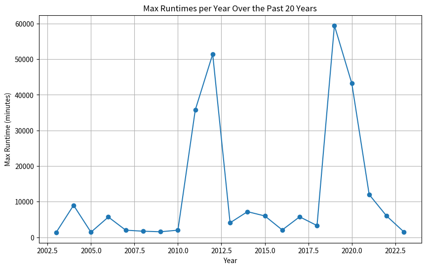
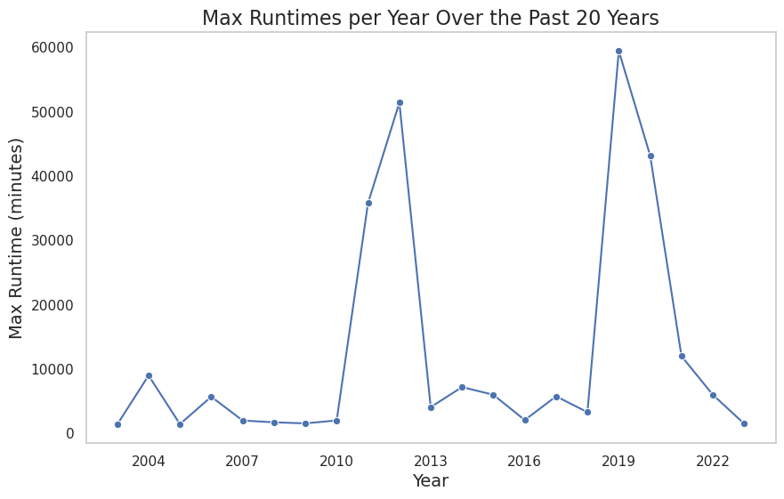

import { OutputBlock } from "@site/src/components/cell";

import {
  Chat,
  UserMessage,
  AssistantMessage,
  ChatFunctionCall,
} from "@site/src/components/chat";

## Introduction

```python cell count=1
import openai
import noteable
```

The Noteable Plugin for ChatGPT exposes rich computational notebooks to GPT Models, allowing you to experiment with data, analysis, and interactive computing in new ways.

Notebooks are a pivotal tool for data scientists, researchers, and engineers. Now, they're available for everyone. Notebooks allow us to communicate ideas, explore data, and share results. Notebooks are a tool for thinking. Most people use them to explore data. They're also a great little laboratory for experimenting with APIs.

Artificial Intelligence companies like OpenAI clearly included notebooks as part of the corpus of training data because their **Large Language Models know notebooks**. ChatGPT can create well documented notebooks with code and prose. It has shown me whole new ways of using libraries and analyzing data that previously were out of reach or just unknown to me. Anyone who knows notebooks and interactive computing in general, knows what this means. It's a big deal.

<Chat>
<UserMessage avatar="https://github.com/rgbkrk.png">

Please create an ETL notebook for the [IMDb dataset](https://datasets.imdbws.com/)

</UserMessage>

<AssistantMessage avatar="">

<ChatFunctionCall>

```json chatcall request plugin=Noteable
{
  "notebook_name": "IMDb_ETL.ipynb"
}
```

```json chatcall response plugin=Noteable
{
  "project_id": "3b179d03-9efb-4f6c-ad7a-fa0a478d45e4",
  "file_id": "d3d944d0-5a18-48b3-bf3e-fdb59d8a5dea",
  "notebook_url": "https://app.noteable.io/f/d3d944d0-5a18-48b3-bf3e-fdb59d8a5dea/IMDb_ETL.ipynb",
  "assistant_hint": "The user can now follow along with your cell work at the notebook link."
}
```

</ChatFunctionCall>

I've created a new notebook named <a>IMDb_ETL_Notebook.ipynb</a>.

Now, let's start by writing the ETL (Extract, Transform, Load) process. The ETL process involves:

1. Extract: Download the IMDb dataset.
2. Transform: Clean and transform the data into a suitable format.
3. Load: Load the transformed data into a data structure or database for analysis.

Let's start with the extraction process. Could you please provide the URL or the location of the IMDb dataset?

</AssistantMessage>
</Chat>

Early experiments with integrating LLMs into notebooks were very promising. Open source projects have shown the potential of integrating IPython and Jupyter with Large Language Models ([Jupyter AI](https://github.com/jupyterlab/jupyter-ai), [genai](https://github.com/noteable-io/genai)). These projects allow for deeper exception handling, inline assistance, and even code generation. It's fantastic. Due to technical limitations in open source Jupyter though, there's no realtime server side access to the notebook document model.

What we needed was a way for the LLM to create and edit cells, start new notebooks, and debug its own code. Everything that would be part of the workflow for a data scientist, data engineer, or anyone else looking to learn in a notebook.

## Enabling Large Language Models to Interact with Notebooks

Building on our foundations for [realtime collaboration and scheduled notebooks](https://github.com/noteable-io/papermill-origami), we began developing a plugin that would allow the model to create and edit cells, start new notebooks, and read outputs. The LLM could participate in the full workflow of data science-everything from data loading to exploration to reporting.

The model can do this because we built a realtime API that allows users to collaborate and notebooks to run server-side as scheduled jobs. This also means that **AI Agents can join the mix**. Let's look at how this happens from a ChatGPT plugin perspective.

Following along with the IMDb ETL example above, ChatGPT proceeds to make Markdown and Code cells in the notebook it created.

<Chat>
<AssistantMessage>
<ChatFunctionCall open>

```javascript chatcall request plugin=Noteable
// ChatGPT requests to use noteable.create_cell
{
  file_id: "f879d549-a4cc-4f5c-bde8-edea8b3950ec",
  cell_type: "markdown",
  source: [
    "# ETL Process for IMDb Dataset\n",
    "\n",
    "## Step 1: Extract\n",
    "\n",
    "The IMDb datasets are available at 'https://datasets.imdbws.com/'. We will download the required datasets for our analysis.",
  ],
}
```

```json chatcall response plugin=Noteable
{
  "cell": {
    "id": "760dad4d-001f-40b3-9375-165a2f67ee21",
    "cell_type": "markdown"
  },
  "cell_link": "https://app.noteable.io/f/f879d549-a4cc-4f5c-bde8-edea8b3950ec/?cellID=760dad4d-001f-40b3-9375-165a2f67ee21",
  "cell_state": null,
  "kernel_state": "idle",
  "kernel_state_description": "Kernel is ready for input",
  "assistant_hint": "The cell was created successfully"
}
```

</ChatFunctionCall>

</AssistantMessage>

</Chat>

The Noteable Plugin tells ChatGPT about the cell ID, a link to the cell, and information about the kernel (runtime) for the notebook. This is important as ChatGPT proceeds to create and run code cells.

<Chat>

<AssistantMessage>

<ChatFunctionCall>

```javascript chatcall request plugin=Noteable
{
  "file_id": "f879d549-a4cc-4f5c-bde8-edea8b3950ec",
  "cell_type": "code",
  "source": [
    "!pip install -q wget",
    "\n",
    "import wget\n",
    "\n",
    "# URLs of the IMDb datasets\n",
    "urls = [\n",
    "    'https://datasets.imdbws.com/name.basics.tsv.gz',\n",
    "    'https://datasets.imdbws.com/title.akas.tsv.gz',\n",
    "    'https://datasets.imdbws.com/title.basics.tsv.gz',\n",
    "    'https://datasets.imdbws.com/title.crew.tsv.gz',\n",
    "    'https://datasets.imdbws.com/title.episode.tsv.gz',\n",
    "    'https://datasets.imdbws.com/title.principals.tsv.gz',\n",
    "    'https://datasets.imdbws.com/title.ratings.tsv.gz'\n",
    "]\n",
    "\n",
    "# Download the datasets\n",
    "for url in urls:\n",
    "    wget.download(url)"
  ],
  "and_run": true
}
```

```javascript chatcall response plugin=Noteable
{
  "cell": {
    "id": "edf64f21-40a8-4b8a-a39c-845242f66851",
    "cell_type": "code",
  },
  "cell_link": "https://app.noteable.io/f/f879d549-a4cc-4f5c-bde8-edea8b3950ec/?cellID=edf64f21-40a8-4b8a-a39c-845242f66851",
  "cell_state": "executing",
  "kernel_state": "busy",
  "kernel_state_description": "Kernel is processing input",
  "assistant_hint": "The cell was created successfully\nCell execution taking more than 11 seconds.\nGet the cell for final results, or have the user view their notebook cell at\nhttps://app.noteable.io/f/f879d549-a4cc-4f5c-bde8-edea8b3950ec/?cellID=edf64f21-40a8-4b8a-a39c-845242f66851 to learn more."
}
```

</ChatFunctionCall>

I've started the process of downloading the IMDb datasets. This process might take a while due to the large size of the datasets. You can check the progress in your notebook here.

Once the download is complete, we can proceed to the next step of the ETL process, which is data transformation. In this step, we will clean and preprocess the data to make it suitable for analysis.

Do you have any specific transformations or cleaning steps you'd like to apply to the data? For example, removing null values, filtering specific columns, etc.

</AssistantMessage>

<UserMessage avatar="https://github.com/rgbkrk.png">

Go ahead and load the title basics into a dataframe.

</UserMessage>

</Chat>

What's amazing about this is that it can feel like having a partner to work on the notebook with you, directly. Cells live update in your separate window of the notebook open on Noteable.

```python cell count=4
import pandas as pd

# Load the dataset into a pandas DataFrame
df = pd.read_csv('title.ratings.tsv', sep='\t')
```

As soon as you have data loaded, start requesting visualizations.

<Chat>

<UserMessage avatar="https://github.com/rgbkrk.png">

Please visualize the max runtimes per year over the past 20 years.

</UserMessage>

<AssistantMessage>

<ChatFunctionCall>

```json chatcall request plugin=Noteable
{
  "file_id": "169e3c44-5b82-4101-9fec-52ca2d84962d",
  "cell_type": "code",
  "source": [
    "import matplotlib.pyplot as plt",
    "import datetime",
    "\n",
    "# Clean the data",
    "title_basics['startYear'] = pd.to_numeric(title_basics['startYear'], errors='coerce')",
    "title_basics['runtimeMinutes'] = pd.to_numeric(title_basics['runtimeMinutes'], errors='coerce')",
    "\n",
    "# Filter the data for the past 20 years",
    "current_year = datetime.datetime.now().year",
    "title_basics_filtered = title_basics[(title_basics['startYear'] >= current_year - 20) & (title_basics['startYear'] <= current_year)]",
    "\n",
    "# Group by year and get the max runtime",
    "max_runtimes = title_basics_filtered.groupby('startYear')['runtimeMinutes'].max()",
    "\n",
    "# Plot the data",
    "plt.figure(figsize=(10, 6))",
    "plt.plot(max_runtimes.index, max_runtimes.values, marker='o')",
    "plt.xlabel('Year')",
    "plt.ylabel('Max Runtime (minutes)')",
    "plt.title('Max Runtimes per Year Over the Past 20 Years')",
    "plt.grid(True)",
    "plt.show()"
  ],
  "and_run": true
}
```

```json chatcall request plugin=Noteable
{
  "cell": {
    "id": "7daa7f99-097e-48c6-9467-ae79e29a9a7b",
    "source": "import matplotlib.pyplot as plt\nimport datetime\n\n# Clean the data\ntitle_basics['startYear'] = pd.to_numeric(title_basics['startYear'], errors='coerce')\ntitle_basics['runtimeMinutes'] = pd.to_numeric(title_basics['runtimeMinutes'], errors='coerce')\n\n# Filter the data for the past 20 years\ncurrent_year = datetime.datetime.now().year\ntitle_basics_filtered = title_basics[(title_basics['startYear'] >= current_year - 20) & (title_basics['startYear'] <= current_year)]\n\n# Group by year and get the max runtime\nmax_runtimes = title_basics_filtered.groupby('startYear')['runtimeMinutes'].max()\n\n# Plot the data\nplt.figure(figsize=(10, 6))\nplt.plot(max_runtimes.index, max_runtimes.values, marker='o')\nplt.xlabel('Year')\nplt.ylabel('Max Runtime (minutes)')\nplt.title('Max Runtimes per Year Over the Past 20 Years')\nplt.grid(True)\nplt.show()",
    "metadata": {
      "noteable": {
        "cell_type": "code",
        "output_collection_id": "183eb3d9-d050-4f20-8b65-d868a66466bb"
      }
    },
    "cell_type": "code",
    "outputs": [
      {
        "type": "display_data",
        "mimetype": "image/png",
        "assistant_hint": null,
        "url": "https://chat.noteable.io/origami/o/97599da17b2b47d0a620945c89fc1bd1.png"
      }
    ]
  },
  "cell_link": "https://app.noteable.io/f/169e3c44-5b82-4101-9fec-52ca2d84962d/?cellID=7daa7f99-097e-48c6-9467-ae79e29a9a7b",
  "cell_state": "finished_with_no_error",
  "kernel_state": "idle",
  "kernel_state_description": "Kernel is ready for input",
  "assistant_hint": null
}
```

</ChatFunctionCall>

Here is the plot showing the maximum runtimes per year over the past 20 years:



</AssistantMessage>

</Chat>

It's not perfect by any means! As you can see in the chart above, ChatGPT didn't convert the years to timestamps leading to the x-axis showing `2017.5`. Nothing a little prompting can't fix.

<Chat>

<UserMessage avatar="https://github.com/rgbkrk.png">

On the x-axis, it should read as whole years not "2017.5". Can you also make this a much more beautiful plot? Human readable labels, no grid. Real clean modern infographic.

</UserMessage>

<AssistantMessage>

<ChatFunctionCall>

```json chatcall request plugin=Noteable
{
  "file_id": "169e3c44-5b82-4101-9fec-52ca2d84962d",
  "cell_type": "code",
  "source": [
    "import seaborn as sns",
    "\n",
    "sns.set_theme(style='whitegrid')",
    "\n",
    "# Create a figure and a set of subplots",
    "fig, ax = plt.subplots(figsize=(10, 6))",
    "\n",
    "# Plot the data",
    "sns.lineplot(x=max_runtimes.index, y=max_runtimes.values, marker='o', ax=ax)",
    "\n",
    "# Set xticks as integers (whole years)",
    "ax.xaxis.set_major_locator(plt.MaxNLocator(integer=True))",
    "\n",
    "# Remove the grid",
    "ax.grid(False)",
    "\n",
    "# Set labels and title",
    "ax.set_xlabel('Year', fontsize=14)",
    "ax.set_ylabel('Max Runtime (minutes)', fontsize=14)",
    "ax.set_title('Max Runtimes per Year Over the Past 20 Years', fontsize=16)",
    "\n",
    "# Show the plot",
    "plt.show()"
  ],
  "and_run": true
}
```

```json chatcall response plugin=Noteable
{
  "cell": {
    "id": "9d16e873-2f43-4d9c-ba95-28131fd05eb2",
    "source": "import seaborn as sns\n\nsns.set_theme(style='whitegrid')\n\n# Create a figure and a set of subplots\nfig, ax = plt.subplots(figsize=(10, 6))\n\n# Plot the data\nsns.lineplot(x=max_runtimes.index, y=max_runtimes.values, marker='o', ax=ax)\n\n# Set xticks as integers (whole years)\nax.xaxis.set_major_locator(plt.MaxNLocator(integer=True))\n\n# Remove the grid\nax.grid(False)\n\n# Set labels and title\nax.set_xlabel('Year', fontsize=14)\nax.set_ylabel('Max Runtime (minutes)', fontsize=14)\nax.set_title('Max Runtimes per Year Over the Past 20 Years', fontsize=16)\n\n# Show the plot\nplt.show()",
    "metadata": {
      "noteable": {
        "cell_type": "code",
        "output_collection_id": "e509680d-f48a-4131-97fe-00062385b1df"
      }
    },
    "cell_type": "code",
    "outputs": [
      {
        "type": "display_data",
        "mimetype": "image/png",
        "assistant_hint": null,
        "url": "https://chat.noteable.io/origami/o/984967bccd8b479594f508f6674c2251.png"
      }
    ]
  },
  "cell_link": "https://app.noteable.io/f/169e3c44-5b82-4101-9fec-52ca2d84962d/?cellID=9d16e873-2f43-4d9c-ba95-28131fd05eb2",
  "cell_state": "finished_with_no_error",
  "kernel_state": "idle",
  "kernel_state_description": "Kernel is ready for input",
  "assistant_hint": "The cell was created successfully"
}
```

</ChatFunctionCall>

Here is the updated plot showing the maximum runtimes per year over the past 20 years. I've made the x-axis labels as whole years and improved the aesthetics of the plot for a cleaner, more modern look:



</AssistantMessage>

</Chat>

One of my favorite approaches once I reach this stage with data loading is to start asking questions of my data. I'll apply domain knowledge to my _real datasets_ (unlike this example). ChatGPT will debug, reason about outputs and exceptions, and generally be a great partner in tandem with the Noteable Plugin. You know who else can? ChatGPT's Code Interpreter.

## Rapid Iteration with GPT Models and Interpreters

There isn't just one way to code. There are also many ways to create data products. In both ChatGPT with the Noteable Plugin and OpenAI's Code Interpreter, the underlying Large Language Model can reason, debug, run code, analyze data, and more.

One of the strengths of OpenAI's Code Interpreter is that it's fast to start up. Additionally, they've used some clever prompting and Reinforcement Learning from Human Feedback (RLHF) to create a compelling user experience.

However, one aspect of the Code Interpreter's design limits its capability: it's ephemeral. This approach allows for aggressive caching (speed to startup), but it also means you lose your work when your session ends.

I know this from [creating tmpnb back in 2014](https://speakerdeck.com/rgbkrk/tmpnb-at-pytexas?slide=10), which we used to [provide notebooks to readers of an IPython article in the Nature Journal](https://www.nature.com/articles/515151a). Not long after we had this deployed for everyone, we started finding out that people wanted to use our temporary notebooks for real analysis work. We fundamentally disrupted the problem of _access_ and people wanted _more_. That means access to external APIs and especially external SQL data sources. Done securely, this is the most useful advancement in user interfaces to Large Language Models we've seen yet.

Whether you're using OpenAI's Code Interpreter, Jupyter extensions, or Noteable, the underlying models from OpenAI excel at performing analysis work and collaborating with human users.

If anyone from OpenAI is reading this, **thank you so much for the models and the absolutely stunning APIs**. I'm not even getting a chance to gush about [what you can build with Chat Functions yet](https://chatlab.dev/). Another time, very soon.

## Providing Durable Access with Notebooks

For some people and workloads, an ephemeral environment is perfect. For others, they need a more durable solution—this is where a Notebook Platform like Noteable comes in. I enjoy all the access to my data files, environment variables/secrets, and databases.

Notebooks document computations. They're expressive, reproducible communication tools for collaborating with others. The hosted environment expands the possibilities for analysis tasks, and git integration lets our platform participate in robust, durable projects.

While LLMs are powerful as standalone tools, they are even more powerful when exposed to notebooks. I've always been excited to enable more people to feel the delight of interactive computing. Now it feels like that reach is much more broad and more accessible.

My goal is to build excellent environments for collaborative analysis and development. To enable everyone, from small teams to massive scale. We're seeing a glimpse of this now with Noteable and OpenAI's GPT models. I can't wait to see what you create.

My goal is to build excellent environments for collaborative analysis and development. To enable everyone, from small teams to massive scale. We're seeing a glimpse of this now with Noteable and OpenAI's GPT models. Collaboration now includes not only human peers but also **artificial intelligence in the same document**. I can't wait to see what you create.

<a
  class="button button--primary"
  href="https://app.noteable.io/f/66fe418e-aceb-419d-b1f8-17eb2eb1be04/ChatGPT-Plugin-for-Jupyter-Notebooks.ipynb"
  style={{
    marginBottom: "20px",
    fontSize: "1em",
  }}
>
  Get started with the Noteable Plugin today!
</a>

P.S. If you're a developer, reach out. We're launching a way for you to do everything you can do in the plugin faster directly with APIs compatible with your favorite LLM tooling.
