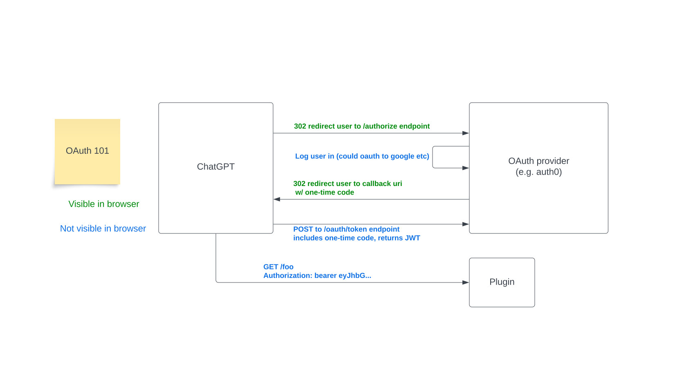
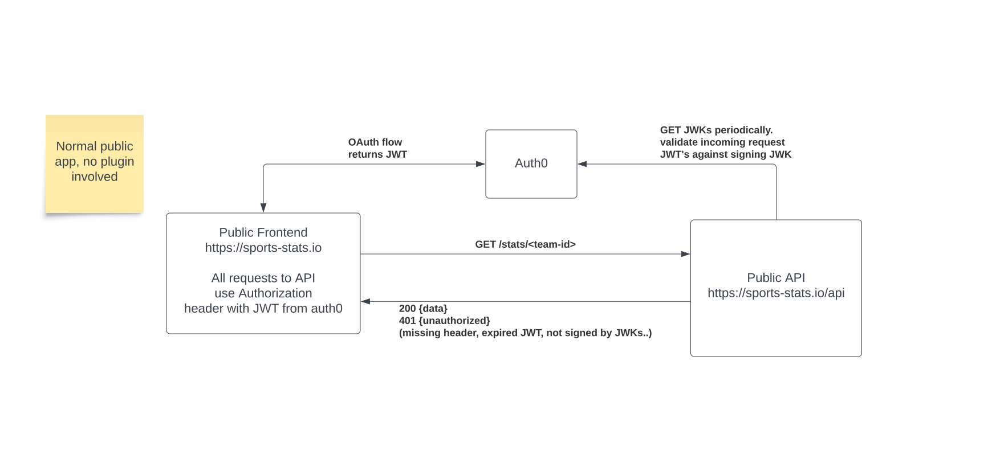
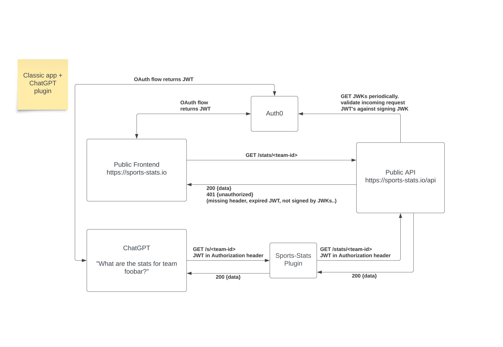
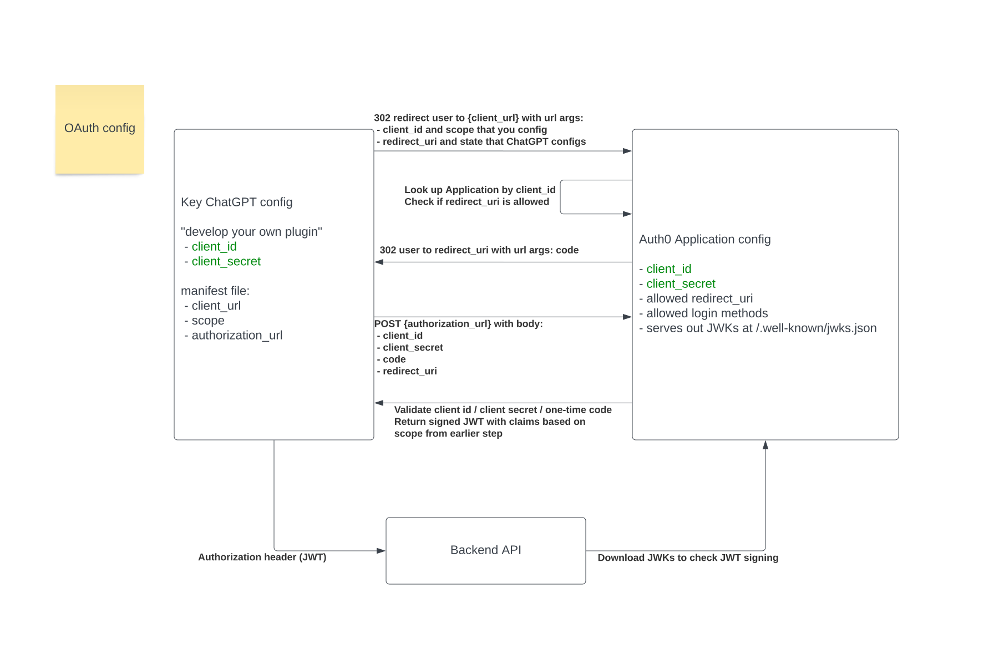
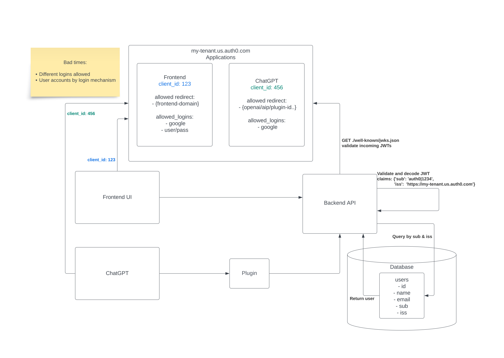
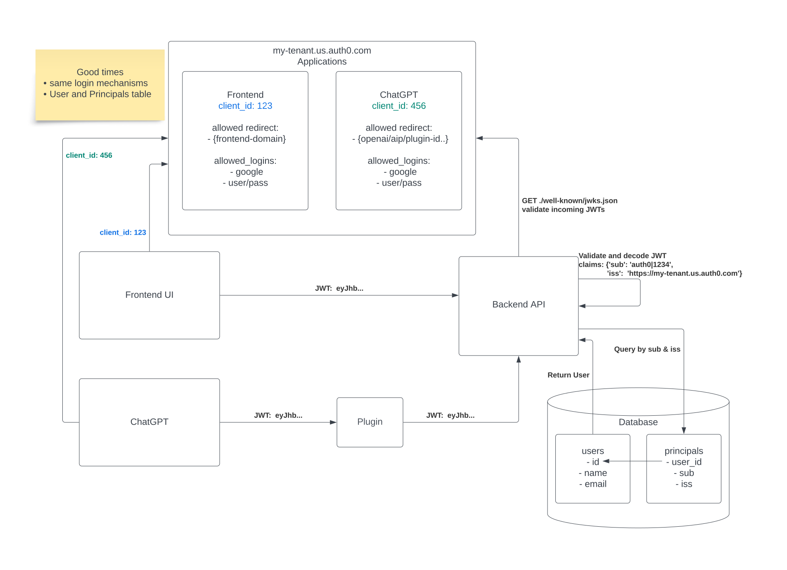
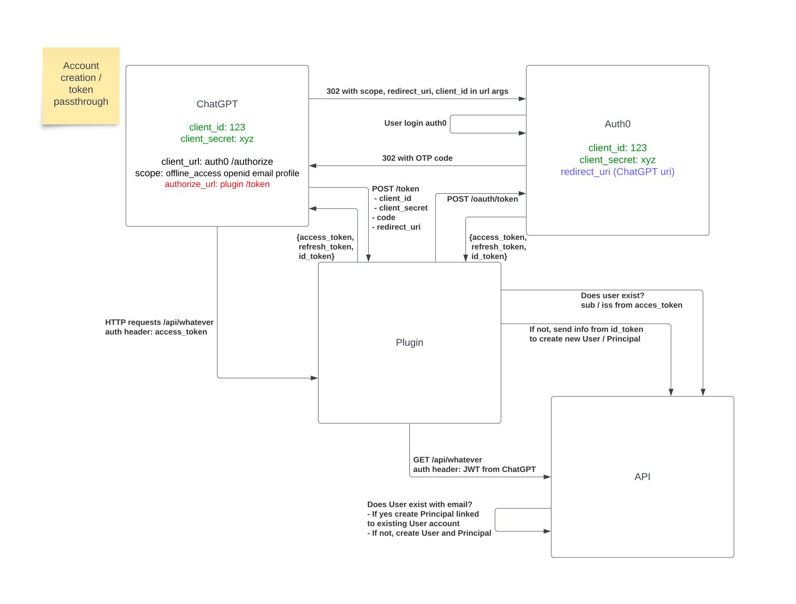
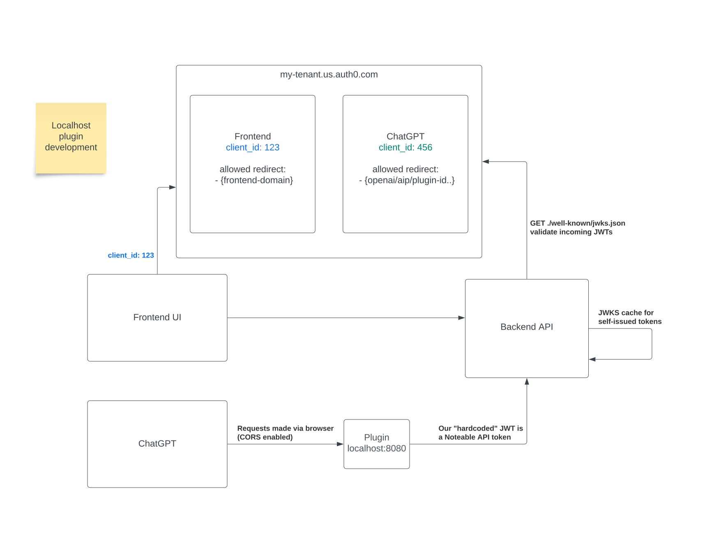

## Introduction

OAuth is a mechanism used to enable Single Sign-On (SSO) across applications. When you install the Noteable ChatGPT plugin, you can choose to login or sign up (it's free!) to Noteable using an existing Google, Github, or LinkedIn account. In this post, the Noteable engineering team wants to share some of the low-level details of how OAuth works, and how it's implemented in Noteable. We hope this helps other plugin developers and the community at large.

Let’s start with why a plugin would use OAuth, compared to “no auth” or “service level auth”. Simply put, if your plugin or downstream API needs to know about a logged in user, use OAuth. For instance, if you were writing a wikipedia-reading plugin you could skip OAuth because you don’t need to have a logged in user to read Wiki. If the large language model (LLM) is creating Notebooks and running code via the Noteable plugin, which goes through role-based access control (RBAC) permission checks and user-context-aware features, we need to know what user account the request is for.

There are many OAuth providers out there, and there's nothing stopping you from writing your own. We happen to use [Auth0](https://auth0.com/), so our examples will include their implementation details (such as `authorize` and `/oauth/token` endpoints). OpenAI and Auth0 both have good documentation about OAuth flows, I recommend reading these sections in addition to this blog post if you're working on an OAuth plugin yourself.

- https://platform.openai.com/docs/plugins/authentication/oauth
- https://auth0.com/docs/authenticate/protocols/oauth#authorization-endpoint

## OAuth 101

When you click `Install` on an OAuth-enabled ChatGPT plugin, your browser will be redirected to the OAuth provider page. Once you've completed logging in there, which may entail even more OAuth redirect jumps, the provider will redirect you back to ChatGPT. If everything goes well, ChatGPT will acquire a JSON web token (JWT) that it will include in an Authorization header on every HTTP request to your plugin.

A JWT contains limited identity information about the authenticated user, and has an expiration. You can learn more about JWT's and decode the payloads in a JWT at [jwt.io](https://jwt.io/).

:::note
When you are developing a plugin in localhost mode, the only authorization type allowed is "none". You cannot test OAuth flows in localhost development mode. You will need to host your plugin somewhere or use a tool like [ngrok](https://ngrok.com/) to create a proxy to your machine.

:::

## OAuth apps

OAuth and JWT's are not unique to ChatGPT plugins. A typical front-end / back-end web application would use an OAuth flow very similar to the ChatGPT plugin experience. On the backend, you can validate that the JWT's you're receiving were issued by the OAuth provider you trust by using JSON Web Keys (JWK). At Noteable we use the [`jwcrypto`](https://jwcrypto.readthedocs.io/en/latest/) Python library.

The Noteable ChatGPT plugin is more or less a proxy to our main API. There's a little more going on in our application, but a plugin that is effectively a pass-through to another API can pass the JWT it got from ChatGPT right along as an Authorization header to the real API.

## OAuth configuration

Once you're ready to test out OAuth with your plugin, the first step is to have your plugin hosted somewhere besides `localhost` and for your manifest file (`ai-plugin.json`) to have its auth section set to type oauth. You'll also need to have the `client_url` and `authorization_url` point to the endpoints of your OAuth provider for the initial redirect and POST to grab the jwt respectively.

When you click "develop your own plugin" in ChatGPT and give it the domain your plugin is hosted at, it will try to download the manifest file and OpenAPI spec file. If it sees your manifest file has type oauth, it will prompt you to enter the client_id and client_secret from your OAuth provider. After you've put those in, ChatGPT will give you a token that you need to add to your manifest file and then redeploy / restart. If ChatGPT can pull the manifest file and see the new token, then the "develop your own plugin" flow is complete and ChatGPT will give you a plugin application id that you can use to update the redirect_uri in your OAuth provider.

:::note
Scope is optional, and is an empty string in the OpenAI example. Noteable uses scopes `openid profile email offline_access` in order get back three tokens during the OAuth process: `access_token`, `id_token`, and `refresh_token` (all are JWTs).

- ChatGPT uses the `access_token` in Authorization headers to our plugin
- ChatGPT will automatically refresh `access_token` using the `refresh_token`
- Noteable uses the name and email from the `id_token` payload to create a User account in Noteable if one does not already exist

You can read more about scopes [here](https://auth0.com/docs/get-started/apis/scopes/openid-connect-scopes)

:::

## Painful Lessons

One decision we made early on at Noteable that turned out to be a mistake was creating User accounts using the `sub` payload from the Auth0 identity tokens, and looking up a User row in our database from the `sub` in the Auth0 access token. Each login mechanism ended up being its own separate User in our system. If you logged in to [app.noteable.io](https://app.noteable.io) using your Github social login, then installed the ChatGPT plugin and authenticated with your Google login, you would end up with all sorts of permission denied errors trying to work on Notebooks between them. It was a major pain point.

A compounding problem was that we were enforcing email verification for username / password accounts using a rule in Auth0 that would not return a JWT until the user clicked a link in their email. In our Noteable app frontend, when you signed up that way we could direct the user what to do. However we had no control over the ChatGPT UI, and from the user perspective they would install the Noteable plugin and it would fail with no error message. Technically there was an error code in url arguments of the redirect from Auth0 back to ChatGPT, but it would take an eagle-eyed user to notice that. Our temporary solution was to disable username / password login from the Auth0 application we used for ChatGPT, funneling even more users into the multiple-account problem space.

Our solution was to create a second database table we called Principals to represent the login mechanism. A Google, Github, or Auth0 username/password login with the same email all link to the same User account now. We reconfigured our ChatGPT manifest file to proxy the authorize and token endpoints through our plugin so that we could automatically create or link Noteable accounts during the OAuth flow. We moved the email verification onto our own system instead of within an Auth0 rule, with error handling in the plugin to tell the user that while they did successfully install the Noteable ChatGPT plugin, they still need to click the email verification link before it will successfully create Notebooks or run code for them.

## Localhost development

We mentioned at the top of the post that you cannot do OAuth testing in localhost development. If your backend API requires a JWT for authentication though, what do you do? Luckily at Noteable we issue our own tokens for programmatic access to our API, which we'll talk more about in other blog posts and show off in Origami documentation.

## Final Thoughts
