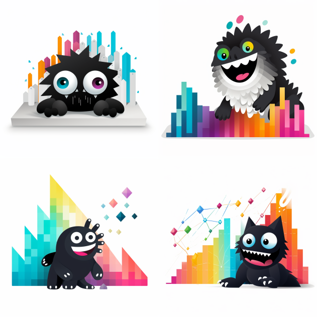
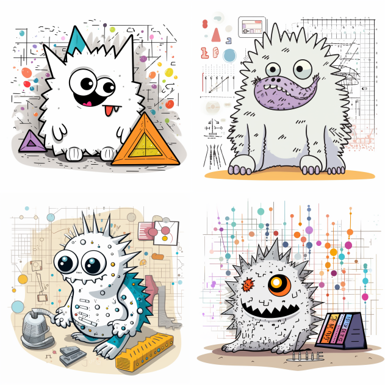

import { OutputBlock } from "@site/src/components/cell";

import ThemedImage from "@theme/ThemedImage";

import chartsworth_light from "./chartsworth-transparent.png";
import chartsworth_dark from "./chartsworth-transparent-invert.png";

import {
  Chat,
  UserMessage,
  AssistantMessage,
  ChatFunctionCall,
} from "@site/src/components/chat";

import SlackMessage, {
  ReplyBar,
  SlackThread,
} from "@site/src/components/SlackMessage";

Sometimes it's hard to get people to read your notebook reports no matter how many times you post them. To solve this, let's push reports _directly_ to your colleagues in slack under the veneer of an adorable chart monster.

```python cell count=0
!pip install chartsworth -q
```

## Introducing Chartsworth

Hi! 👋🏻 This is Chartsworth.

```python cell count=1
from chartsworth import Chartsworth

chartsworth = Chartsworth()
```

<ThemedImage
  alt="Chartsworth the chart monster. A rough sketch outline of a floating monster with scruffy fur and adorable eyes amidst axes."
  sources={{
    light: chartsworth_light,
    dark: chartsworth_dark,
  }}
  height={300}
  width={300}
  style={{
    display: "block",
    marginLeft: "auto",
    marginRight: "auto",
  }}
/>

<br />
<br />

Chartsworth posts from **notebooks** to **slack**. This little metric monster lets you post plots, images, and anything else the slack sdk will let you post.

```python cell count=2
day = "Monday"
emoji = "tada"
signups = 8127

message = f"""
Happy {day}! It's time for our daily update. :{emoji}:

\# of :new: signups so far this month: *{signups}*
""".strip()

chartsworth.post(message)
```

<SlackMessage avatarUrl={chartsworth_light} avatarUrlDark={chartsworth_dark} name="Chartsworth" timestamp="10:04 AM">

Happy Saturday! It's time for our daily update. :tada:

\# of :new: signups so far this month: **8127**

</SlackMessage>

Each time you call `post`, Chartsworth will keep the thread going. You can keep posting without inundating your colleagues with too many messages. They can open the :thread: for more detail.

```python cell count=3
chartsworth.post("I'm going to post a plot now!")

# fig can be any matplotlib figure
fig = chartsworth.create_monster_plot()

chartsworth.post(fig)
```

<SlackThread>

<SlackMessage avatarUrl={chartsworth_light} avatarUrlDark={chartsworth_dark} name="Chartsworth" timestamp="10:04 AM">

Happy Saturday! It's time for our daily update. :tada:

\# of :new: signups so far this month: **8127**

</SlackMessage>

<ReplyBar count={2} />

<SlackMessage avatarUrl={chartsworth_light} avatarUrlDark={chartsworth_dark} name="Chartsworth" timestamp="10:04 AM">

I'm going to post a plot now!

</SlackMessage>

<SlackMessage avatarUrl={chartsworth_light} avatarUrlDark={chartsworth_dark} name="Chartsworth" timestamp="10:04 AM">

<div style={{ display: "flex", flexDirection: "column" }}>
  <span style={{ color: "var(--ifm-color-emphasis-500)" }}>
    monster-plot.png ▾
  </span>
  
</div>

</SlackMessage>

</SlackThread>

With this in place, you can start to build your own chart monsters to post from your notebooks.
[Set up a Slack App](#set-them-up-as-a-slack-app) and install `chartsworth` to start posting!

## Scheduling

The most interesting and useful way to use a chart monster is to schedule their work. Integrate them into your data workflows to get insight into your data pipelines, reports, or even just a daily affirmation.

<div
  style={{
    display: "flex",
    alignItems: "center",
    justifyContent: "center",
    marginBottom: "20px",
  }}
>
  <div
    style={{ padding: "10px", border: "1px solid #eee", marginRight: "20px" }}
  >
    ETL
  </div>
  <div
    style={{
      width: "0",
      height: "0",
      borderTop: "10px solid transparent",
      borderBottom: "10px solid transparent",
      borderLeft: "10px solid #eee",
      marginRight: "20px",
    }}
  ></div>
  <div
    style={{ padding: "10px", border: "1px solid #eee", marginRight: "20px" }}
  >
    Derived Data
  </div>
  <div
    style={{
      width: "0",
      height: "0",
      borderTop: "10px solid transparent",
      borderBottom: "10px solid transparent",
      borderLeft: "10px solid #eee",
      marginRight: "20px",
    }}
  ></div>
  <div style={{ padding: "10px", border: "1px solid #eee" }}>Reporting</div>
</div>

<p>
  {`Within Noteable, save a named version. On the righthand sidebar click the `}
  <svg
    fill="currentColor"
    data-icon="history"
    width="20"
    height="20"
    viewBox="0 0 20 20"
  >
    <desc>history</desc>
    <path
      d="M10 0C6.71 0 3.82 1.6 2 4.05V2c0-.55-.45-1-1-1s-1 .45-1 1v4c0 .55.45 1 1 1h4c.55 0 1-.45 1-1s-.45-1-1-1H3.76C5.23 3.17 7.47 2 10 2c4.42 0 8 3.58 8 8s-3.58 8-8 8-8-3.58-8-8c0-.55-.45-1-1-1s-1 .45-1 1c0 5.52 4.48 10 10 10s10-4.48 10-10S15.52 0 10 0zm0 3c-.55 0-1 .45-1 1v6c0 .28.11.53.29.71l3 3a1.003 1.003 0 001.42-1.42L11 9.59V4c0-.55-.45-1-1-1z"
      fill-rule="evenodd"
    ></path>
  </svg>
  {` icon. After that, you can schedule the notebook to run regularly.`}
</p>

<ThemedImage
  alt="Chartsworth the chart monster. A rough sketch outline of a floating monster with scruffy fur and adorable eyes amidst axes."
  sources={{
    light: require("./schedule.png").default,
    dark: require("./schedule.png").default,
  }}
  style={{
    display: "block",
    marginLeft: "auto",
    marginRight: "auto",
    marginBottom: "20px",
  }}
/>

This will free you up from "running a daily report" by hand yourself and let you focus on the more interesting parts of your work.

## Creating your first chart monster

:::note

This post will cover how to write your own version of Chartsworth, and how to use it to post from Notebooks to Slack.

You can also `pip install chartsworth` and use all the baked in opinions.

:::

### Set a Chart Monster up as a Slack App

The first step is to create a Slack app. This is a fairly straightforward process, but it does require a few steps.

1. Go to [api.slack.com/apps](https://api.slack.com/apps) and click the "Create New App" button.

2. Click "Create New App"


3. Click "From an app manifest", select your workspace, and click "Next"

At this point it should show you a basic manifest like this:

```json
{
  "display_information": {
    "name": "Demo App"
  },
  "settings": {
    "org_deploy_enabled": false,
    "socket_mode_enabled": false,
    "is_hosted": false,
    "token_rotation_enabled": false
  }
}
```

4. Click Next, and then Create. From here you'll land at the app's settings page. Scroll down to "Display Information" so we can **add personality** ✨.


To make your chart monster, I recommend the following prompts for Midjourney, DALL-E 2, or Stable Diffusion.

> black and white monster on a matplotlib chart, slack app logo



> a white monster sits amidst matplotlib axes, in the style of dynamic mark making, rough clusters, poodlepunk, scientific diagrams, comic art, simple line drawings, furry art a white monster with eyes is shown with scales, in the style of simplistic ink drawings, comic/cartoon, furry art, spot metering, heavy outlines, frostpunk, konica big mini, a monster is being measured with an x and y axis, in the style of dynamic sketching, rough clusters, sabattier filter, non-linear, large-scale, jump cuts, poodlepunk an image of a cute grey monster metrics, in the style of simplistic ink drawings, maya lin, zeiss batis 18mm f/2.8, frank miller, luminous shadowing, lively facial expressions, spiky mounds



## 🛠️ How Chartsworth Posts

Slack makes it really easy to post directly using the `slack_sdk`. Above I used the opinionated version of this workflow using `chartsworth`. Let's unpack how do this with the `slack_sdk` directly.

```python cell count=3
!pip install slack_sdk -q

import os
from slack_sdk import WebClient

client = WebClient(token=os.environ["SLACK_API_TOKEN"])

# This can be any channel you've invited your @Chartsworth into
channel = "#chartsworth-dev"
```

Let's post!

```python cell count=4
message_response = slack_client.chat_postMessage(
    channel=chartsworth_channel,
    text="I am ready to *plot*"
)
```

Assuming _you too_ have a `#chartsworth-dev` channel, there should now be a post.

### Threading

The most useful field from the `message_response` is the timestamp, which you can use to thread replies.

```python cell count=5
message_response["ts"]
```

```cell output count=5
'1693611091.015119'
```

You can use this timestamp to thread replies.

```python cell count=6
message_response = slack_client.chat_postMessage(
    channel=chartsworth_channel,
    text=":tada:",
    thread_ts=message_response["ts"],
)
```

### Plotting

Let's post a plot! We're going to use my favorite plot, the monster plot.

```python cell count=6
def create_monster_plot():
    """Creates a Monstrous Matplotlib Figure."""
    # Create a Matplotlib figure object.
    fig, ax = plt.subplots()

    # Create some eyes
    eye1_x = np.random.uniform(0.25, 0.75)
    eye1_y = np.random.uniform(0.7, 0.9)
    eye2_x = np.random.uniform(0.25, 0.75)
    eye2_y = np.random.uniform(0.7, 0.9)
    ax.plot(eye1_x, eye1_y, "o", markersize=20, color="black")
    ax.plot(eye2_x, eye2_y, "o", markersize=20, color="black")

    # Create a mouth
    x = np.linspace(0, 1, 100)
    y = 0.2 + 0.1 * np.sin(np.random.uniform(1, 10) * x + np.random.uniform(0, 2 * np.pi))
    ax.plot(x, y, color="black", linewidth=2)

    # Set the aspect ratio of the plot to 1 so the monster looks dope
    ax.set_aspect("equal", adjustable="box")
    ax.set_ylim(0, 1)

    # Don't let matplotlib show the plot immediately
    plt.close(fig)

    return fig
```

The way to make a plot appear is to save it to a file or a buffer using `savefig`. After that you can use the `files_upload_v2` method to post the image.

```python cell count=7
fig = create_monster_plot()

image_stream = io.BytesIO()
fig.savefig(image_stream, format="png")
# Close the figure so it doesn't show up in the notebook
plt.close(fig)
image_stream.seek(0)

slack_client.files_upload_v2(
    channels=chartsworth_channel,
    initial_comment="Here's a monster plot!",
    file=image_stream,
    filename="monster.png",
)
```

which should result in a post like this:

<SlackThread>

<SlackMessage avatarUrl={chartsworth_light} avatarUrlDark={chartsworth_dark} name="Chartsworth" timestamp="10:04 AM">

Happy Saturday! It's time for our daily update. :tada:

\# of :new: signups so far this month: **8127**

</SlackMessage>

<ReplyBar count={2} />

<SlackMessage avatarUrl={chartsworth_light} avatarUrlDark={chartsworth_dark} name="Chartsworth" timestamp="10:04 AM">

:tada:

</SlackMessage>

<SlackMessage avatarUrl={chartsworth_light} avatarUrlDark={chartsworth_dark} name="Chartsworth" timestamp="10:04 AM">

<div style={{ display: "flex", flexDirection: "column" }}>
  <span style={{ color: "var(--ifm-color-emphasis-500)" }}>
    monster-plot.png ▾
  </span>
  
</div>

</SlackMessage>

</SlackThread>

## Why Chart Monsters?

Chartsworth is not just another tool; it's a way to think about how we communicate data and results. It's a way to make data more accessible and more fun. You can still provide the link to your notebook so people can see the source. Giving people an at-a-glance where they're already at will encourage people to engage with your work more.
