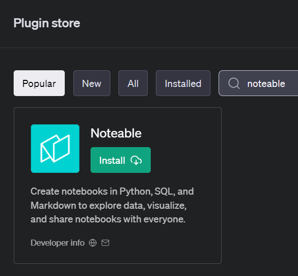
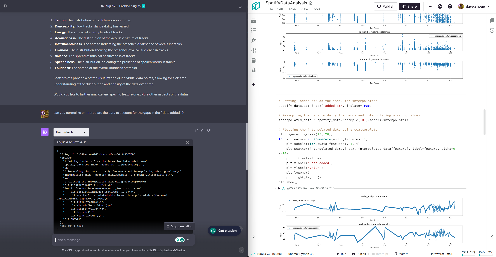
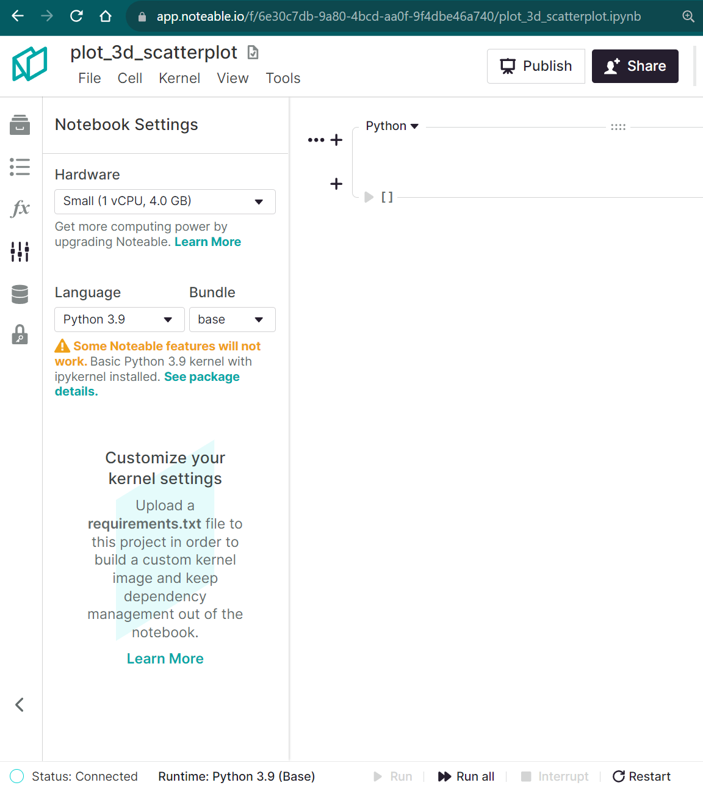

# Background

When [ChatGPT](https://chat.openai.com/) burst onto the tech scene, it didn't just nudge the boundaries of conversational AI – it blew right past them. The digital landscape, already well-acquainted with the incremental wonders of technology, found itself in the throes of another revolution. But OpenAI didn’t stop there. By introducing access to [plugins](https://openai.com/blog/chatgpt-plugins), it allowed ChatGPT to seamlessly take user prompts and meld them with other services' APIs. This was not just another feature; it was a gateway to endless integrations and applications.

By early May 2023, Noteable released its own ChatGPT plugin, and almost instantly, the plugin became the go-to tool for those with an itch for data analysis. 



What set the Noteable plugin apart from other plugins was its ability to transform conversations into tangible data analysis, all encapsulated within a [Jupyter-notebook](https://jupyter.org/) compatible document. This breakthrough meant that users weren’t just getting answers; they were obtaining a detailed artifact of their entire analytical journey. Such a document serves as an invaluable asset for documentation, further analysis, and collaboration. The blend of conversational AI with the structured format of Jupyter notebooks provides both clarity and context, ensuring that insights derived from data aren't just momentary flashes but are well-recorded, replicable, and ready for deeper exploration.



Yet, as powerful as ChatGPT plugins are, they come with their own limitations. They operate separately from the OpenAI API and, for the time being, are tied exclusively to the GPT-4 model. This naturally prompts users to contemplate the potential of wider avenues beyond a single model or user interface.

# Interacting with the Noteable API with OpenAI's function calling API

For the curious minds and the restless tinkerers, this post is for you. Let's embark on a journey to uncover how to interface with the Noteable API using its foundational python package, `origami`, while also leveraging the power of OpenAI's function calling API. 

:::note
Feel free to look at the OpenAI [function calling docs](https://platform.openai.com/docs/guides/gpt/function-calling) for reference as we move along.
:::

As a quick summary, the OpenAI function calling API allows users or services to expose functionality to an LLM, so when a prompt is sent, the LLM can respond with a suggestion to call on that exposed functionality. It does **not** allow the LLM call the function directly.

## Install Dependencies

To get started, we first need to install some Python packages into our Python environment of choice: 
+ [`noteable-origami`](https://noteable-io.github.io/origami/quickstart/)
+ [`openai`](https://platform.openai.com/docs/api-reference?lang=python)

In a notebook environment:
```python cell
!pip install noteable-origami openai
```
Or in a terminal:
```bash
pip install noteable-origami openai
```

## Authentication
We'll need both an [`OPENAI_API_KEY`](https://platform.openai.com/docs/libraries/python-library) as well as [`NOTEABLE_TOKEN`](https://noteable-io.github.io/origami/quickstart/#api-tokens) as environment variables in to authenticate to both services.

```python cell
import openai
import os

openai.api_key = os.environ['OPENAI_API_KEY']
```

## Function Calling Setup

To enable OpenAI's function calling API to use `origami` functions, we'll need to outline a few key steps:
- generating JSON schemas for functions
- sending a request to the OpenAI chat completion API
- parsing the response with function calling arguments

Let's get started by breaking down each step. For the first portions of this blog series, we'll be creating the function schemas by hand. This will help get a base understanding of what OpenAI is looking for, and we'll do this using a couple different examples.

The following is a very basic function that takes three arguments of different variable types, with the last one, `baz`, being optional.

```python cell
def test_func(
    foo: str,
    bar: int,
    baz: Optional[dict] = None,
):
    """Sample function"""
    print(f"ChatGPT's favorite food is {foo}.")
    print(f"It thought about the Roman Empire {bar} time(s).")
    if baz:
        rprint(f"Its favorite rock stars are: {baz}")
    else:
        rprint("It doesn't have any favorite rock stars.")
```

The main parts of the function schema are the `name`, `description`, and the `parameters`.

```json
{
    "name": "test_func",
    "description": "Sample function",
    "parameters": {
        "type": "object",
        "properties": {
            # fill in the arguments here
        },
        "required": [
            # add required argument names here
        ],
    },
}
```
Once we fill in the function arguments and add some basic descriptions, we might end up with something like this:
```python cell
test_func_schema = {
    "name": "test_func",
    "description": "Sample function",
    "parameters": {
        "type": "object",
        "properties": {
            "foo": {
                "type": "string",
                "description": "Your favorite food",
            },
            "bar": {
                "type": "integer",
                "description": "The number of times you've thought about the Roman Empire",
            },
            "baz": {
                "type": "object",
                "description": "Names and ages of your favorite rock stars",
            },
        },
        "required": ["foo", "bar"],
    },
}
```
After that, we can pass it to OpenAI with a basic prompt.

:::note
We're explicitly passing in `function_call={"name": "test_func"}` here to see the function call response. It's set to `auto` by default, which means we may get either a basic text response or a function call response.

See [related docs](https://platform.openai.com/docs/api-reference/chat/create#function_call).
:::

```python cell
response = openai.ChatCompletion.create(
    messages=[{
        "role": "user",
        "content": "print some made-up data."
    }],
    functions=[test_func_schema],
    model="gpt-3.5-turbo",
    function_call={"name": "test_func"},
)
response_message = response.choices[0]['message'].to_dict_recursive()
response_message
```
```python cell output
{
    'role': 'assistant',
    'content': None,
    'function_call': {
        'name': 'test_func', 
        'arguments': '{\n  "foo": "pizza",\n  "bar": 10\n}'
    }
}
```

```python cell
import json

call_args = json.loads(response_message["function_call"]["arguments"])
result = test_func(**call_args)
result
```
```cell output
ChatGPT's favorite food is pizza.
It thought about the Roman Empire 10 time(s).
It doesn't have any favorite rock stars.
```

Now let's switch to a more relevant example. Next, we'll write a function that can create a new Noteable notebook and start a kernel for us.

```python cell
import uuid

from origami.models.api.files import File
from origami.models.kernels import KernelSession


async def create_notebook_and_launch_kernel(
    file_path: str,
    project_id: Optional[uuid.UUID] = None,
    kernel_name: str = "python3.9",
    hardware_size: str = "small",
) -> dict:
    """Create a Notebook in a Project and launch a Kernel session."""
    # if we're not specifying a project ID, just use what we pulled earlier
    project_id = project_id or user_info.origamist_default_project_id
    file: File = await api_client.create_notebook(project_id, file_path)
    kernel_session: KernelSession = await api_client.launch_kernel(
        file_id=file.id,
        kernel_name=kernel_name,
        hardware_size=hardware_size,
    )
    return {
        'file_url': file.url,
        'kernel_state': kernel_session.kernel.execution_state,
    }
```

Using the function above for reference, we can create its function schema:

```python
start_notebook_func_schema = {
    'name': 'create_notebook_and_launch_kernel',
    'description': 'Create a Notebook in a Project and launch a Kernel session.',
    'parameters': {
        'type': 'object',
        'properties': {
            'file_path': {
                'type': 'string',
                'description': 'Path to the file to create. Must end in .ipynb.',
            },
            'project_id': {
                'type': 'string',
                'format': 'uuid',
                'description': 'If not specified, will use the user\'s default project.',
            },
            'kernel_name': {
                'type': 'string',
                'description': 'Name of the kernel to launch.',
                'default': 'python3.9',
            },
            'hardware_size': {
                'type': 'string',
                'description': 'Hardware size of the kernel.',
                'default': 'small',
            },
        },
        'required': ['file_path'],
    },
}
```

This time, we'll try it out without specifying the `function_call` argument.

```python cell
response = openai.ChatCompletion.create(
    messages=[
        {
            "role": "user",
            "content": "Make a notebook for making a 3d scatterplot using the plotly python package",
        }
    ],
    functions=[start_notebook_func_schema],
    model="gpt-3.5-turbo",
)
response_message = response.choices[0]['message'].to_dict_recursive()
response_message
```
```python cell output
{
    'role': 'assistant',
    'content': None,
    'function_call': {
        'name': 'create_notebook_and_launch_kernel',
        'arguments': '{\n  "file_path": "3D_Scatterplot.ipynb",\n  "kernel_name": "python3.9"\n}'}
}
```

Now if we run the arguments it provided:

```python
call_args = json.loads(response_message["function_call"]["arguments"])
file_kernel = await create_notebook_and_launch_kernel(**call_args)
file_kernel
```
```python cell output
{
    'file_url': 'https://app.noteable.io/f/bcd12345-6789-4abc-d012-3456abcdef90/3D_Scatterplot.ipynb',
    'kernel_state': 'requested'
}
```

# Putting it all together

The basics are done, and all that's left is to clean it up into a convenience function to enable a feedback loop. To do this, we'll build up a `messages` list that includes our first prompt, along with the assistant responses along the way.

```python
async def run_conversation(
    prompt: Optional[str] = None,
    messages: Optional[list] = None,
    model: str = "gpt-3.5-turbo",
) -> list:
    """Run a conversation with a given model."""
    messages = messages or []
    if prompt:
        messages.append({"role": "user", "content": prompt})

    response = openai.ChatCompletion.create(
        messages=messages,
        functions=[start_notebook_func_schema],
        model=model,
    )
    response_message = response.choices[0]['message'].to_dict_recursive()
    messages.append(response_message)

    # since we didn't specify `function_call={"name": "create_notebook_and_launch_kernel"}`, we need
    # to check if the response has a function call or if it's just a content string
    if "function_call" not in response_message.keys():
        print(f"Assistant: {response_message["content"]}")
        return messages

    call_args = json.loads(response_message["function_call"]["arguments"])
    try:
        file_kernel: dict = await create_notebook_and_launch_kernel(**call_args)
        system_message = (
            f"The file was successfully created and a kernel was launched. "
            f"Kernel state: `{file_kernel['kernel_state']}` "
            f"File URL: `{file_kernel['file_url']}`"
        )
    except Exception as e:
        system_message = f"Problem creating a file or starting a kernel session: `{e}`"

    # add a system message to the conversation to let the assistant know that the kernel session was
    # created, along with its current execution state
    messages.append(
        {
            "role": "system",
            "content": system_message,
        }
    )
    return await run_conversation(messages=messages)
```
```python cell
messages = await run_conversation("create a new notebook for making a 3d scatterplot using the plotly python package")
```
```markdown cell output
Assistant: I have created a new notebook for you to make a 3D scatter plot using the Plotly Python package. You can access the notebook using the following link: [plot_3d_scatterplot.ipynb](https://app.noteable.io/f/6e30c7db-9a80-4bcd-aa0f-9f4dbe46a740/plot_3d_scatterplot.ipynb).
```

If we go to that link, we see the Notebook was created and the kernel successfully launched. 🎉



```python cell output
[
    {
        'role': 'user',
        'content': 'create a new notebook for making a 3d scatterplot using the plotly python package'
    },
    {
        'role': 'assistant',
        'content': None,
        'function_call': {
            'name': 'create_notebook_and_launch_kernel',
            'arguments': '{\n  "file_path": "plot_3d_scatterplot.ipynb",\n  "kernel_name": "python3.9"\n}'
        }
    },
    {
        'role': 'system',
        'content': 'The file was successfully created and a kernel was launched. Kernel state: `requested` File URL: `https://app.noteable.io/f/6e30c7db-9a80-4bcd-aa0f-9f4dbe46a740/plot_3d_scatterplot.ipynb`'
    },
    {
        'role': 'assistant',
        'content': 'I have created a new notebook for you to make a 3D scatter plot using the Plotly Python package. You can access the notebook using the following link: [plot_3d_scatterplot.ipynb](https://app.noteable.io/f/6e30c7db-9a80-4bcd-aa0f-9f4dbe46a740/plot_3d_scatterplot.ipynb).'
    }
]
```

# Recap


Check out Part 2 for our next steps -- adding cell content, executing code, and retrieving outputs!