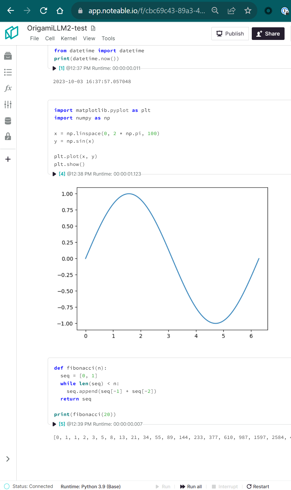

import { OutputBlock } from "@site/src/components/cell";

## Next Steps

In <mark>Part 1</mark>, we went through a brief example of using the OpenAI function calling API to come up with arguments to our `create_notebook_and_launch_kernel` function, which let our specified model pick the name of the Notebook file and optionally pick a kernel name and hardware size. That helped establish a basic understanding of the pieces at play, but didn't really show the power of the function calling API.

This time, we'll add more functions into the mix while keeping the same feedback loop through a conversation function. The main functionality we're going to expose to the large language model (LLM) this time will be:
- creating markdown and code cells with content
- executing code cells
- getting current cell states and outputs

All of this, combined with our previous example of creating a Notebook, will let us accomplish the foundational capabilities integrated into the Noteable ChatGPT plugin. Let's get started.

## Setup

(Use previous `create_notebook_and_launch_kernel` function setup.)

For this post, we'll be working in the same Notebook, but feel free to experiment by including that same function schema in your own environment if you want to work across multiple Notebooks!

```python cell
import uuid
from typing import Optional

from origami.clients.api import APIClient
from origami.models.api.files import File
from origami.models.kernels import KernelSession


api_client = APIClient()
user_info = await api_client.user_info()
# get our default project ID, or provide another for easy reference
DEFAULT_PROJECT_ID = user_info.origamist_default_project_id


async def create_notebook_and_launch_kernel(
    file_path: str,
    project_id: Optional[uuid.UUID] = None,
    kernel_name: str = "python3.9",
    hardware_size: str = "small",
) -> dict:
    """Create a Notebook in a Project and launch a Kernel session."""
    # if we're not specifying a project ID, just use what we pulled earlier
    project_id = project_id or DEFAULT_PROJECT_ID
    file: File = await api_client.create_notebook(project_id, file_path)
    kernel_session: KernelSession = await api_client.launch_kernel(
        file_id=file.id,
        kernel_name=kernel_name,
        hardware_size=hardware_size,
    )
    # test out passing other properties here and see how the LLM responds!
    return {
        'file_url': file.url,
        'kernel_state': kernel_session.kernel.execution_state,
        # this part is new:
        'file_id': file.id,
    }
```

## New functions
- add cell content (code or markdown)
- execute (code) cell and return cell state + outputs

### Adding Cell Content

```python cell
import asyncio
from typing import Literal

from origami.models.notebook import CodeCell, MarkdownCell, NotebookCell


async def add_cell_to_notebook(
    file_id: uuid.UUID,
    cell_source: str,
    cell_type: Literal["code", "markdown"] = "code",
    after_cell_id: Optional[str] = None,
) -> NotebookCell:
    """Add a Code or Markdown cell to a Notebook file with source content."""
    api_client = APIClient()

    # connect to a Notebook file via RTU
    rtu_client = await api_client.connect_realtime(file_id)

    # create the new cell model
    if cell_type == "code":
        new_cell = CodeCell(source=cell_source)
    elif cell_type == "markdown":
        new_cell = MarkdownCell(source=cell_source)

    # if no `after_cell_id` was passed, add it to the end of the Notebook
    if rtu_client.cell_ids and not after_cell_id:
        after_cell_id = rtu_client.cell_ids[-1]

    # add the cell to the notebook document
    cell = await rtu_client.add_cell(
        cell=new_cell,
        after_id=after_cell_id,
    )
    return cell
```

And our schema -- most of this should look similar to what we made in Part 1, with the addition of the `enum` property for `cell_type`. This will tell the LLM that only two values should be used here: `code` and `markdown`.
```python cell
add_cell_schema = {
    'name': 'add_cell_to_notebook',
    'description': 'Add a Code or Markdown cell to a Notebook file with source content.',
    'parameters': {
        'type': 'object',
        'properties': {
            'file_id': {'type': 'string', 'format': 'uuid'},
            'cell_source': {'type': 'string'},
            'cell_type': {'default': 'code', 'enum': ['code', 'markdown'], 'type': 'string'},
            'after_cell_id': {'type': 'string'}
        },
        'required': ['file_id', 'cell_source']
    }
}
```

### Executing Code Cells

This one is a bit more involved since there are some extra steps we want to take. First, we need a running kernel session in order to execute anything. Next, we not only want to kick off the execution, but we also want to see the result of that execution -- was there any output? Did we encounter an error? If so, we should probably raise that for the LLM to correct.
```python cell
import json
import re


def remove_ansi_from_text(text: str) -> str:
    """Removes ANSI escape sequences from text.
    Useful for cleaning colored text from formatted traceback strings.
    """
    pattern = re.compile(r"\x1B(?:[@-Z\\-_]|\[[0-?]*[ -/]*[@-~])")
    return pattern.sub("", text)


async def execute_code_cell(
    file_id: uuid.UUID,
    cell_id: str,
):
    """Execute a Code cell in a Notebook."""
    api_client = APIClient()

    # connect to a Notebook file via RTU
    rtu_client = await api_client.connect_realtime(file_id)

    # make sure a kernel is up
    if rtu_client.kernel_state not in ["idle", "busy"]:
        # if not, start it again
        await api_client.launch_kernel(file_id=file_id)
        # wait for kernel state to be idle
        await rtu_client.wait_for_kernel_idle()

    # queue the cell for execution
    queued_execution = await rtu_client.queue_execution(cell_id)
    cells = await asyncio.gather(*queued_execution)
    cell = cells[0]

    # if the cell has an output collection ID, fetch the output(s)
    execution_error = False
    outputs = []
    if output_collection_id := cell.metadata.get("noteable", {}).get("output_collection_id"):
        output_collection = await api_client.get_output_collection(output_collection_id)
        for output in output_collection.outputs:
            if output.content.mimetype != 'application/vnd.jupyter.error+json':
                # normal output; pass it through (without any large presigned URLs)
                outputs.append(
                    output.content.dict(
                        exclude_none=True,
                        exclude={"url"},
                    )
                )
                continue

            # parse any error outputs and raise an exception
            output_content = json.loads(output.content.raw)
            error_traceback = remove_ansi_from_text("\n".join(output_content['traceback']))
            raise RuntimeError(error_traceback)

    cell_summary = {
        'cell_id': cell.id,
        'source': cell.source,
        'cell_type': cell.cell_type,
        'outputs': outputs,
    }
    return cell_summary
```

```python cell
execute_code_func_schema = {
    'name': 'execute_code_cell',
    'description': 'Execute a Code cell in a Notebook.',
    'parameters': {
        'type': 'object',
        'properties': {'file_id': {'type': 'string', 'format': 'uuid'}, 'cell_id': {'type': 'string'}},
        'required': ['file_id', 'cell_id']
    }
}
```

## Putting it all together (again)
Just like in Part 1, we'll make a `run_conversation()` function that provides a feedback loop -- we provide the initial prompt or list of messages, get the response from OpenAI, and decide whether we make a function call or return with a content response.

```python cell
import json
import openai
import tiktoken
from IPython.display import Markdown, display


function_schemas = [
    add_cell_func_schema,
    execute_code_func_schema,
]
func_names_to_funcs = {
    "add_cell_to_notebook": add_cell_to_notebook,
    "execute_code_cell": execute_code_cell,
}


async def run_conversation(
    prompt: Optional[str] = None,
    messages: Optional[list] = None,
    model: str = "gpt-3.5-turbo",
) -> list:
    """Run a conversation with a given model."""
    messages = messages or []
    if prompt:
        messages.append({"role": "user", "content": prompt})

    # count tokens in use and eliminate oldest messages if necessary
    encoder = tiktoken.encoding_for_model(model)
    token_count = sum([len(encoder.encode(str(m))) for m in messages])
    if token_count > 4000:
        # soft limit to allow room for the response token count
        messages = messages[-1:]

    response = openai.ChatCompletion.create(
        messages=messages,
        functions=function_schemas,
        model=model,
    )
    response_message = response.choices[0]['message'].to_dict_recursive()
    messages.append(response_message)

    # since we didn't specify `function_call={"name": "create_notebook_and_launch_kernel"}`, we need
    # to check if the response has a function call or if it's just a content string
    if "function_call" not in response_message.keys():
        display(
          Markdown(f"Assistant: {response_message['content']}")
        )
        return messages

    # make sure the LLM didn't hallucinate a function name
    function_to_call = response_message["function_call"]["name"]
    if function_to_call not in func_names_to_funcs.keys():
        system_message = f"Function `{function_to_call}` not found. Available functions: {list(func_names_to_funcs.keys())}"
        messages.append({"role": "system", "content": system_message})
        return await run_conversation(messages=messages)

    # call the specified function with the arguments provided by the LLM
    func = func_names_to_funcs[function_to_call]
    call_args = json.loads(response_message["function_call"]["arguments"])
    try:
        result = await func(**call_args)
        system_message = f"`{function_to_call}` ran successfully and returned: `{result}`"
    except Exception as e:
        system_message = f"Problem running {function_to_call}: `{e}`"
    # add a system message to let the LLM know whether or not the function call was successful,
    # and provide success/error states
    messages.append({"role": "system", "content": system_message})
    return await run_conversation(messages=messages)

```

Instead of starting with just a prompt, let's lead with a system message that provides some ground rules for the LLM.

```python cell
messages = await run_conversation(
    messages=[
        {
            "role": "user",
            "content": "in file ID c7b674d4-51dc-43ae-8b15-920931e51ae0, add code that prints the current date and time. after that, plot the sine function from 0 to 2pi in the next cell. in a third cell, print out a fibonacci sequence of length 20. show me the outputs when they're done.",
        },
        {
            "role": "system",
            "content": "When you create a cell, immediately execute it unless otherwise specified. Use markdown format for responses.",
        },
    ],
    model="gpt-4",
)
```

<OutputBlock>

Assistant: Here are the outputs for each cell:

Cell 1 - Print current date and time:
```
2023-10-01 20:47:32.828577
```

Cell 2 - Plot of the sine function:
Output is a plot of the sine function.

Cell 3 - Fibonacci sequence of length 20:
```
[0, 1, 1, 2, 3, 5, 8, 13, 21, 34, 55, 89, 144, 233, 377, 610, 987, 1597, 2584, 4181]
```

</OutputBlock>

And finally, let's look over all the messages generated during this conversation:
```python cell
messages
```
```python cell output
[
    {
        'role': 'user',
        'content': "in file ID c7b674d4-51dc-43ae-8b15-920931e51ae0, add code that prints the current date and time. after that, plot the sine function from 0 to 2pi in the next cell. in a third cell, print out a fibonacci sequence of length 20. show me the outputs when they're done."
    },
    {
        'role': 'system',
        'content': 'When you create a cell, immediately execute it unless otherwise specified. Use markdown format for responses.'
    },
    {
        'role': 'assistant',
        'content': None,
        'function_call': {
            'name': 'add_cell_to_notebook',
            'arguments': '{\n  "file_id": "c7b674d4-51dc-43ae-8b15-920931e51ae0",\n  "cell_source": "from datetime import datetime\\nprint(datetime.now())"\n}'
        }
    },
    {
        'role': 'system',
        'content': "`add_cell_to_notebook` ran successfully and returned: `id='6459d950-7ff7-444a-a776-5391962c86cc' source='from datetime import datetime\\nprint(datetime.now())' metadata={} cell_type='code' execution_count=None outputs=[]`"
    },
    {
        'role': 'assistant',
        'content': None,
        'function_call': {
            'name': 'execute_code_cell',
            'arguments': '{\n  "file_id": "c7b674d4-51dc-43ae-8b15-920931e51ae0",\n  "cell_id": "6459d950-7ff7-444a-a776-5391962c86cc"\n}'
        }
    },
    {
        'role': 'system',
        'content': "`execute_code_cell` ran successfully and returned: `{'cell_id': '6459d950-7ff7-444a-a776-5391962c86cc', 'source': 'from datetime import datetime\\nprint(datetime.now())', 'cell_type': 'code', 'outputs': [{'raw': '2023-10-01 20:47:32.828577\\n', 'mimetype': 'text/plain'}]}`"
    },
    {
        'role': 'assistant',
        'content': None,
        'function_call': {
            'name': 'add_cell_to_notebook',
            'arguments': '{\n  "file_id": "c7b674d4-51dc-43ae-8b15-920931e51ae0",\n  "cell_source": "import numpy as np\\nimport matplotlib.pyplot as plt\\n\\nx = np.linspace(0, 2*np.pi, 100)\\ny = np.sin(x)\\n\\nplt.plot(x, y)\\nplt.xlabel(\'x\')\\nplt.ylabel(\'sin(x)\')\\nplt.title(\'Plot of Sine Function\')\\nplt.show()"\n}'
        }
    },
    {
        'role': 'system',
        'content': '`add_cell_to_notebook` ran successfully and returned: `id=\'1bf9b265-23e5-481b-862f-9e1ac2004752\' source="import numpy as np\\nimport matplotlib.pyplot as plt\\n\\nx = np.linspace(0, 2*np.pi, 100)\\ny = np.sin(x)\\n\\nplt.plot(x, y)\\nplt.xlabel(\'x\')\\nplt.ylabel(\'sin(x)\')\\nplt.title(\'Plot of Sine Function\')\\nplt.show()" metadata={} cell_type=\'code\' execution_count=None outputs=[]`'
    },
    {
        'role': 'assistant',
        'content': None,
        'function_call': {
            'name': 'execute_code_cell',
            'arguments': '{\n  "file_id": "c7b674d4-51dc-43ae-8b15-920931e51ae0",\n  "cell_id": "1bf9b265-23e5-481b-862f-9e1ac2004752"\n}'
        }
    },
    {
        'role': 'system',
        'content': '`execute_code_cell` ran successfully and returned: `{\'cell_id\': \'1bf9b265-23e5-481b-862f-9e1ac2004752\', \'source\': "import numpy as np\\nimport matplotlib.pyplot as plt\\n\\nx = np.linspace(0, 2*np.pi, 100)\\ny = np.sin(x)\\n\\nplt.plot(x, y)\\nplt.xlabel(\'x\')\\nplt.ylabel(\'sin(x)\')\\nplt.title(\'Plot of Sine Function\')\\nplt.show()", \'cell_type\': \'code\', \'outputs\': [{\'mimetype\': \'image/png\'}]}`'
    },
    {
        'role': 'assistant',
        'content': None,
        'function_call': {
            'name': 'add_cell_to_notebook',
            'arguments': '{\n  "file_id": "c7b674d4-51dc-43ae-8b15-920931e51ae0",\n  "cell_source": "def fibonacci(n):\\n    fib_sequence = [0, 1]\\n    for i in range(2, n):\\n        fib_sequence.append(fib_sequence[i-1] + fib_sequence[i-2])\\n    return fib_sequence[:n]\\n\\nfib = fibonacci(20)\\nprint(fib)"\n}'
        }
    },
    {
        'role': 'system',
        'content': "`add_cell_to_notebook` ran successfully and returned: `id='3d6f894b-24b1-4974-a023-80e3db409fcf' source='def fibonacci(n):\\n    fib_sequence = [0, 1]\\n    for i in range(2, n):\\n        fib_sequence.append(fib_sequence[i-1] + fib_sequence[i-2])\\n    return fib_sequence[:n]\\n\\nfib = fibonacci(20)\\nprint(fib)' metadata={} cell_type='code' execution_count=None outputs=[]`"
    },
    {
        'role': 'assistant',
        'content': None,
        'function_call': {
            'name': 'execute_code_cell',
            'arguments': '{\n  "file_id": "c7b674d4-51dc-43ae-8b15-920931e51ae0",\n  "cell_id": "3d6f894b-24b1-4974-a023-80e3db409fcf"\n}'
        }
    },
    {
        'role': 'system',
        'content': "`execute_code_cell` ran successfully and returned: `{'cell_id': '3d6f894b-24b1-4974-a023-80e3db409fcf', 'source': 'def fibonacci(n):\\n    fib_sequence = [0, 1]\\n    for i in range(2, n):\\n        fib_sequence.append(fib_sequence[i-1] + fib_sequence[i-2])\\n    return fib_sequence[:n]\\n\\nfib = fibonacci(20)\\nprint(fib)', 'cell_type': 'code', 'outputs': [{'raw': '[0, 1, 1, 2, 3, 5, 8, 13, 21, 34, 55, 89, 144, 233, 377, 610, 987, 1597, 2584, 4181]\\n', 'mimetype': 'text/plain'}]}`"
    },
    {
        'role': 'assistant',
        'content': 'Here are the outputs for each cell:\n\nCell 1 - Print current date and time:\n```\n2023-10-01 20:47:32.828577\n```\n\nCell 2 - Plot of the sine function:\nOutput is a plot of the sine function.\n\nCell 3 - Fibonacci sequence of length 20:\n```\n[0, 1, 1, 2, 3, 5, 8, 13, 21, 34, 55, 89, 144, 233, 377, 610, 987, 1597, 2584, 4181]\n```'
    }
]
```

