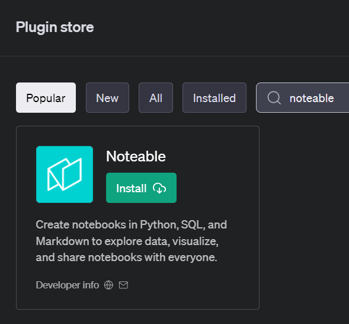
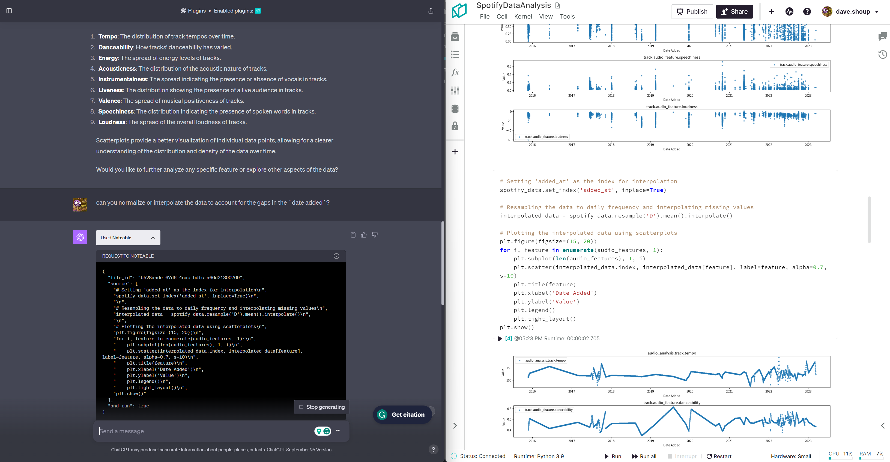

import { OutputBlock } from "@site/src/components/cell";

## Background

When [ChatGPT](https://chat.openai.com/) burst onto the tech scene, it didn't just nudge the boundaries of conversational AI – it blew right past them. The digital landscape, already well-acquainted with the incremental wonders of technology, found itself in the throes of another revolution. But OpenAI didn’t stop there. By introducing access to [plugins](https://openai.com/blog/chatgpt-plugins), it allowed ChatGPT to seamlessly take user prompts and meld them with other services' APIs. This was not just another feature; it was a gateway to endless integrations and applications.

By early May 2023, Noteable released its own ChatGPT plugin, and almost instantly, the plugin became the go-to tool for those with an itch for data analysis. 



What set the Noteable plugin apart from other plugins was its ability to transform conversations into tangible data analysis, all encapsulated within a [Jupyter-notebook](https://jupyter.org/) compatible document. This breakthrough meant that users weren’t just getting answers; they were obtaining a detailed artifact of their entire analytical journey. Such a document serves as an invaluable asset for documentation, further analysis, and collaboration. The blend of conversational AI with the structured format of Jupyter notebooks provides both clarity and context, ensuring that insights derived from data aren't just momentary flashes but are well-recorded, replicable, and ready for deeper exploration.



Yet, as powerful as ChatGPT plugins are, they come with their own limitations. They operate separately from the OpenAI API and, for the time being, are tied exclusively to the GPT-4 model. This naturally prompts users to contemplate the potential of wider avenues beyond a single model or user interface.

## Interacting with the Noteable API with OpenAI's function calling API

For the curious minds and the restless tinkerers, this post is for you. Let's embark on a journey to uncover how to interface with the Noteable API using its foundational Python package, `origami`, while also leveraging the power of OpenAI's function calling API.

:::note
Feel free to look at the OpenAI [function calling docs](https://platform.openai.com/docs/guides/gpt/function-calling) for reference as we move along.
:::

At a high level, the OpenAI function calling API allows users or services to expose functionality to a large language model (LLM), so when a prompt is sent, the LLM can respond with a suggestion to call on that exposed functionality. It does **not** allow the LLM call function(s) directly.

### Install Dependencies

To get started, we first need to install some packages into our Python environment:
+ [`noteable-origami`](https://noteable-io.github.io/origami/quickstart/)
+ [`openai`](https://platform.openai.com/docs/api-reference?lang=python)

In a notebook environment:
```python cell
!pip install noteable-origami openai
```
Or in a terminal:
```bash
pip install noteable-origami openai
```

### Authentication
We'll need both [`OPENAI_API_KEY`](https://platform.openai.com/docs/libraries/python-library) as well as [`NOTEABLE_TOKEN`](https://noteable-io.github.io/origami/quickstart/#api-tokens) as environment variables in order to authenticate to both services.

:::tip
If you're using [Noteable](https://app.noteable.io) as your Python environment of choice, you can create [Secrets](https://docs.noteable.io/product-docs/collaborate/access-and-visibility/secrets-permissions) for both of these, and they will be available as environment variables while executing code cells.
:::

### Function Calling Setup

To enable OpenAI's function calling API to use `origami` functions, we'll need to outline a few key steps:
- generating JSON schemas for functions
- sending a request to the OpenAI chat completion API
- parsing the response with function calling arguments

Let's get started by breaking down each step. For the first portions of this blog series, we'll be creating the function schemas by hand. This will help set a base understanding of what OpenAI is looking for, and we'll go over this structure with a couple different examples.

### Basic Example
The following is a very basic function that takes three arguments of different variable types, with the last one, `baz`, being optional.

```python cell count=1
from typing import Optional

def test_func(
    foo: str,
    bar: int,
    baz: Optional[dict] = None,
):
    """Sample function"""
    print(f"ChatGPT's favorite food is {foo}.")
    print(f"It thought about the Roman Empire {bar} time(s).")
    if baz:
        print(f"Its favorite rock stars are: {baz}")
    else:
        print("It doesn't have any favorite rock stars.")
```

The main parts of the function schema are the `name`, `description`, and the `parameters`. (If you're familiar with JSON schemas at all, the `parameters` section should look familiar.)

```json
{
    "name": "test_func",
    "description": "Sample function",
    "parameters": {
        "type": "object",
        "properties": {
            # fill in the arguments here
        },
        "required": [
            # add required argument names here
        ],
    },
}
```
Once we fill in the function arguments and add some basic descriptions, we might end up with something like this:
```python cell count=2
test_func_schema = {
    "name": "test_func",
    "description": "Sample function",
    "parameters": {
        "type": "object",
        "properties": {
            "foo": {
                "type": "string",
                "description": "Your favorite food",
            },
            "bar": {
                "type": "integer",
                "description": "The number of times you've thought about the Roman Empire",
            },
            "baz": {
                "type": "object",
                "description": "Names and ages of your favorite rock stars",
            },
        },
        "required": ["foo", "bar"],
    },
}
```
Now that we have a basic function schema, we try it out by passing it to OpenAI with a basic prompt.

:::note
The `function_call` argument is set to `auto` by default, which means it would return either a basic text response or a function call response. By giving it the name of the function, we're explicitly saying that we want a function call response back.

See [related docs](https://platform.openai.com/docs/api-reference/chat/create#function_call).
:::

```python cell count=3
import openai

# feel free to change this and play around with the results!
initial_prompt = "print some made-up data"

response = openai.ChatCompletion.create(
    messages=[
        {
            "role": "user",
            "content": initial_prompt,
        }
    ],
    functions=[test_func_schema],
    model="gpt-3.5-turbo",
    function_call={"name": "test_func"},
)
response_message = response.choices[0]['message'].to_dict_recursive()
response_message
```
```python cell output count=3
{
    'role': 'assistant',
    'content': None,
    'function_call': {
        'name': 'test_func', 
        'arguments': '{\n  "foo": "pizza",\n  "bar": 10\n}'
    }
}
```

Here we see the model suggesting `test_func` should be called with the arguments `{"foo": "pizza", "bar": 10}` (and nothing for `baz`, because it was optional). If we pass those arguments into our test function directly, we'll see the following:
```python cell count=4
import json

call_args = json.loads(response_message["function_call"]["arguments"])
result = test_func(**call_args)
result
```
```cell output count=4
ChatGPT's favorite food is pizza.
It thought about the Roman Empire 10 time(s).
It doesn't have any favorite rock stars.
```

### Example with `origami`
Now let's switch to a more relevant example using the `origami` package. Next, we'll write a function that can create a new Noteable Notebook and start a kernel for us. But first, we need a Noteable Project ID to work with. 

To keep things simple, we're going to use the same default Project as ChatGPT. You can swap this out for a Project of your choosing, though.

:::note
If you go to [Noteable](https://app.noteable.io), you'll likely see the Spaces page with at least one Project listed. Right-clicking and copying the link to one of those should give you a URL that looks like this:
```
https://app.noteable.io/p/a1b2c3d4-e5f6-4a7b-8123-abcdef123456/My-ChatGPT-Project
```
Copy/paste that UUID between the `/p/` and the name of the Project to provide it as the default here if you don't want to use the ChatGPT default.
:::

```python cell count=5
from origami.clients.api import APIClient

api_client = APIClient()
user_info = await api_client.user_info()
# use the same user-default project id as ChatGPT
project_id = user_info.origamist_default_project_id
project_id
```
```python cell output count=5
UUID('a1b2c3d4-e5f6-4a7b-8123-abcdef123456')
```

#### Creating a Notebook & Launching a Kernel

Alright, onto creating our new Notebook-creating function.

```python cell count=6
import uuid

from origami.models.api.files import File
from origami.models.kernels import KernelSession


async def create_notebook_and_launch_kernel(
    file_path: str,
    project_id: Optional[uuid.UUID] = None,
    kernel_name: str = "python3.9",
    hardware_size: str = "small",
) -> dict:
    """Create a Notebook in a Project and launch a Kernel session."""
    # if we're not specifying a project ID, just use what we pulled earlier
    project_id = project_id or user_info.origamist_default_project_id
    file: File = await api_client.create_notebook(project_id, file_path)
    kernel_session: KernelSession = await api_client.launch_kernel(
        file_id=file.id,
        kernel_name=kernel_name,
        hardware_size=hardware_size,
    )
    # test out passing other properties here and see how the LLM responds!
    return {
        'file_url': file.url,
        'kernel_state': kernel_session.kernel.execution_state,
    }
```
(For the time being, we're only returning the Notebook's URL and the state of the kernel to pass as context back to the LLM in cells further down.)

Using the function above for reference, we can create its function schema like how we did for `test_func` above. In this case, adding `description` properties to each argument is helpful context for the LLM.

```python cell count=7
start_notebook_func_schema = {
    'name': 'create_notebook_and_launch_kernel',
    'description': 'Create a Notebook in a Project and launch a Kernel session.',
    'parameters': {
        'type': 'object',
        'properties': {
            'file_path': {
                'type': 'string',
                'description': 'Path to the file to create. Must end in .ipynb.',
            },
            'project_id': {
                'type': 'string',
                'format': 'uuid',
                'description': 'If not specified, will use the user\'s default project.',
            },
            'kernel_name': {
                'type': 'string',
                'description': 'Name of the kernel to launch.',
                'default': 'python3.9',
            },
            'hardware_size': {
                'type': 'string',
                'description': 'Hardware size of the kernel.',
                'default': 'small',
            },
        },
        'required': ['file_path'],
    },
}
```

And again, we'll test it out while specifying the `function_call` argument.

```python cell count=8
response = openai.ChatCompletion.create(
    messages=[
        {
            "role": "user",
            "content": "Make a notebook for making a 3d scatterplot using the plotly python package",
        }
    ],
    functions=[start_notebook_func_schema],
    function_call={"name": "create_notebook_and_launch_kernel"},
    model="gpt-3.5-turbo",
)
response_message = response.choices[0]['message'].to_dict_recursive()
response_message
```
```python cell output count=8
{
    'role': 'assistant',
    'content': None,
    'function_call': {
        'name': 'create_notebook_and_launch_kernel',
        'arguments': '{\n  "file_path": "3D_Scatterplot.ipynb",\n  "kernel_name": "python3.9"\n}'}
}
```

It successfully provided a `file_path`, and even chose to specify a `kernel_name` (even though one wasn't required). If we run the function with the provided arguments, we should see our `file_id` and `kernel_state`:

```python cell count=9
call_args = json.loads(response_message["function_call"]["arguments"])
file_kernel = await create_notebook_and_launch_kernel(**call_args)
file_kernel
```
```python cell output count=9
{
    'file_url': 'https://app.noteable.io/f/bcd12345-6789-4abc-d012-3456abcdef90/3D_Scatterplot.ipynb',
    'kernel_state': 'requested'
}
```

## Putting it all together

The basics are done, and all that's left is to turn it into a convenience function to enable a feedback loop. To do this, we'll build up a `messages` list that includes our first `prompt` string, along with the assistant responses along the way. Here's how it should work:

- The first time we call `run_conversation()`, we'll pass in our starting prompt as a `user` message like we did before.
- We won't specify `function_call` this time, which means the response may be text content or a function call with suggested arguments.
- If we get a text/content response, we'll exit the function and return all messages from the conversation.
- If we get a function call response, we'll execute the function and create a `system` message to add to our `messages` list.
  - The idea here is that the `system` message will inform the LLM whether or not a file was created and a kernel was started. If all goes well, the LLM should respond with text/content echoing back the file URL and kernel state.

Ideally, the conversation should flow like this:

- Call `run_conversation()` with `prompt`
  - `User`: "create a new notebook for making a 3d scatterplot using the plotly python package"
  - `Assistant`: (function call `create_notebook_and_launch_kernel` with `file_path` argument, maybe more)
  - `<run create_notebook_and_launch_kernel(**args)>`
  - `System`: "The file was successfully created and a kernel was launched. ..."
- Call `run_conversation()` again, with `messages`
  - `Assistant`: "Your file was created at `<file url>` ..." (or some similar successful status message)
  - `<return>`

(In a more complicated example with multiple functions, we would probably use a dictionary of `func_name: func` pairs to call the correct function depending on value of the `["function_call"]["name"]` in the response.)

```python cell count=10
from IPython.display import Markdown, display


async def run_conversation(
    prompt: Optional[str] = None,
    messages: Optional[list] = None,
    model: str = "gpt-3.5-turbo",
) -> list:
    """Run a conversation with a given model, providing either a starting prompt or a list of
    messages with the `{"role": "user"/"assistant"/"system", "content": "..."}` format.
    """
    messages = messages or []
    if prompt:
        # start building up `messages` with our first user prompt
        messages.append({"role": "user", "content": prompt})

    response = openai.ChatCompletion.create(
        messages=messages,
        functions=[start_notebook_func_schema],
        model=model,
    )
    response_message = response.choices[0]['message'].to_dict_recursive()
    # whatever happens here, keep the `assistant` message in the history
    messages.append(response_message)

    # since we didn't specify `function_call={"name": "create_notebook_and_launch_kernel"}`, we need
    # to check if the response has a function call or if it's just a content string
    if "function_call" not in response_message.keys():
        # we got a text/content response; display it as markdown for easy viewing, then exit cleanly
        display(
            Markdown(f"Assistant: {response_message['content']}")
        )
        return messages

    # time to parse the args and call our function!
    call_args = json.loads(response_message["function_call"]["arguments"])
    try:
        file_kernel: dict = await create_notebook_and_launch_kernel(**call_args)
        system_message = (
            f"The file was successfully created and a kernel was launched. "
            f"Kernel state: `{file_kernel['kernel_state']}` "
            f"File URL: `{file_kernel['file_url']}`"
        )
    except Exception as e:
        # if something goes wrong here, make sure we inform the LLM and it can either echo back an
        # error state or attempt to self-correct
        system_message = f"Problem creating a file or starting a kernel session: `{e}`"

    # add a system message to the conversation to let the assistant know that the kernel session was
    # created, along with its current execution state
    messages.append({"role": "system", "content": system_message})
    
    return await run_conversation(messages=messages)
```
```python cell count=11
messages = await run_conversation("create a new notebook for making a 3d scatterplot using the plotly python package")
```
<OutputBlock count={11}>

Assistant: I have created a new notebook for you to make a 3D scatter plot using the Plotly Python package. You can access the notebook using the following link: [plot_3d_scatterplot.ipynb](https://app.noteable.io/f/6e30c7db-9a80-4bcd-aa0f-9f4dbe46a740/plot_3d_scatterplot.ipynb).

</OutputBlock>

If we go to that link, we see the Notebook was created and the kernel successfully launched. 🎉


And if we examine `messages`, we see each message that was generated during the conversation -- our starting prompt, the first assistant `function_call` response, the system message, and the final assistant text/content response.
```python cell count=12
messages
```
```python cell output count=12
[
    {
        'role': 'user',
        'content': 'create a new notebook for making a 3d scatterplot using the plotly python package'
    },
    {
        'role': 'assistant',
        'content': None,
        'function_call': {
            'name': 'create_notebook_and_launch_kernel',
            'arguments': '{\n  "file_path": "plot_3d_scatterplot.ipynb",\n  "kernel_name": "python3.9"\n}'
        }
    },
    {
        'role': 'system',
        'content': 'The file was successfully created and a kernel was launched. Kernel state: `requested` File URL: `https://app.noteable.io/f/6e30c7db-9a80-4bcd-aa0f-9f4dbe46a740/plot_3d_scatterplot.ipynb`'
    },
    {
        'role': 'assistant',
        'content': 'I have created a new notebook for you to make a 3D scatter plot using the Plotly Python package. You can access the notebook using the following link: [plot_3d_scatterplot.ipynb](https://app.noteable.io/f/6e30c7db-9a80-4bcd-aa0f-9f4dbe46a740/plot_3d_scatterplot.ipynb).'
    }
]
```

## Recap

In this post, we touched on the OpenAI plugins and how to mimic similar behavior with OpenAI's function calling API, wrote some basic function schemas, and got our feet wet with the `origami` package by creating a notebook and starting a kernel using arguments provided by the LLM responses.

That's it for this part of the series, be sure to check out Part 2 for our next steps where we build on the lessons learned here.  We'll dive into creating more function schemas with the `origami` package to add cell content to our notebook, execute code, and retrieve outputs.

Thanks for reading!

