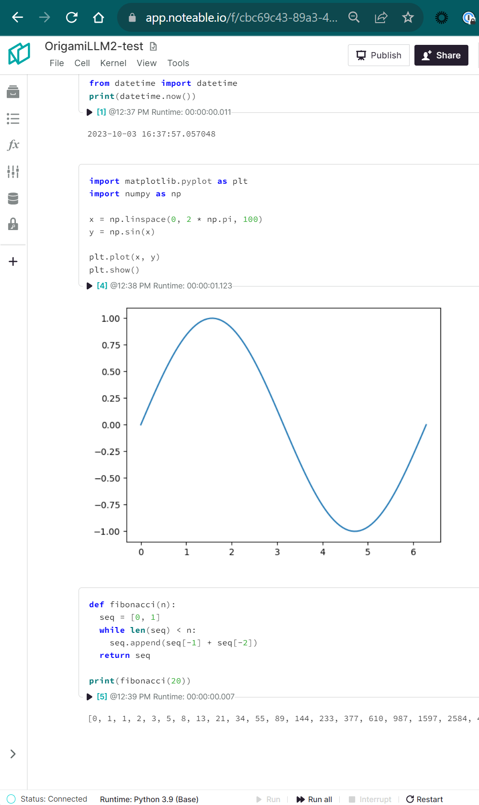

import { OutputBlock } from "@site/src/components/cell";

## Next Steps

In [Part 1](../2023-10-05-origami-openai/index.mdx), we went through a brief example of using the OpenAI function calling API to come up with arguments to our `create_notebook_and_launch_kernel` function, which let our specified model pick the name of the Notebook file, and optionally provide a kernel name and hardware size. That helped establish a basic understanding of the pieces at play, but didn't _really_ show the power of the function calling API.

This time, we'll add more functions into the mix while keeping the same feedback loop through a conversation function. The main functionality we're going to expose to the large language model (LLM) this time focus around molding the body of the Notebook itself -- the code and markdown cells, along with any outputs from executed code.

All of this, combined with our previous example of creating a Notebook, will let us accomplish the foundational capabilities integrated into the Noteable ChatGPT plugin. Let's get started.

## Setup

Make sure our required packages are available:
```python cell
!pip install noteable-origami openai tiktoken
```
:::note
`tiktoken` is new here; since we expect more function calls to be made, we may end up going over the 4096-token limit that OpenAI enforces. We'll set a soft limit of 4000 tokens for testing, but depending on the model you use, you can bump that number up even higher. In any case, it's a good idea to keep track of the tokens you're using before sending requests (from both a cost/usage perspective, as well as to avoid hitting the limit part-way through a chain of requests).
:::

For the sake of simplicity, we'll be working in a single Notebook for the duration of this post, but you can experiment with including that same `start_notebook_func_schema` function schema from [Part 1](../2023-10-05-origami-openai/index.mdx#example-with-origami) in your own environment if you want to see how the LLM does with working across multiple Notebooks!

The function below should look familiar, but with the additions of setting a global `DEFAULT_PROJECT_ID` and returning a `file_id` in the response, which we'll need to provide for the new functionality further down.

```python cell
import uuid
from typing import Optional

from origami.clients.api import APIClient
from origami.models.api.files import File
from origami.models.kernels import KernelSession


api_client = APIClient()
user_info = await api_client.user_info()
# get our default Project ID from the ChatGPT default, or provide another for easy reference,
# e.g. 'a1b2c3d4-e5f6-4a7b-8123-abcdef123456' from the following URL:
# https://app.noteable.io/p/a1b2c3d4-e5f6-4a7b-8123-abcdef123456/My-ChatGPT-Project
# highlight-next-line
DEFAULT_PROJECT_ID = user_info.origamist_default_project_id


async def create_notebook_and_launch_kernel(
    file_path: str,
    project_id: Optional[uuid.UUID] = None,
    kernel_name: str = "python3.9",
    hardware_size: str = "small",
) -> dict:
    """Create a Notebook in a Project and launch a Kernel session."""
    # if we're not specifying a project ID, just use what we pulled earlier
    project_id = project_id or DEFAULT_PROJECT_ID
    file: File = await api_client.create_notebook(project_id, file_path)
    kernel_session: KernelSession = await api_client.launch_kernel(
        file_id=file.id,
        kernel_name=kernel_name,
        hardware_size=hardware_size,
    )
    # test out passing other properties here and see how the LLM responds!
    return {
        'file_url': file.url,
        'kernel_state': kernel_session.kernel.execution_state,
        # highlight-start
        # this part is new:
        'file_id': file.id,
        # highlight-end
    }
```

## New functions

Here comes the fun part -- adding multiple new functions that the LLM will have to choose from. If we think about regular Notebook use, the bulk of it comes down to an iterative combination of the following:
- add cells and content (code or markdown)
- update/replace cell content
- getting the current cells
- execute (code) cell and return cell state + outputs
- delete cells

So let's break these down and generate some new functions and schemas. 

:::caution Warning

The code sections below are going to get a bit complicated. Part of this is to get ahead of common scenarios we've seen before (attempting to run code without a kernel session, handling error outputs, etc) rather than make an exhaustive guide to incrementally handling every situation. 

If this feels overwhelming, don't worry -- Part 3 will get into transitioning this more complicated functionality over to the [`chatlab`](https://github.com/rgbkrk/chatlab) package as well as using the Noteable ChatGPT plugin directly, where these scenarios are already handled.

:::

Before we get anywhere in a Notebook, we need content. Whether it's documentation in markdown cells, or executable source in code cells, adding cells with content is a capability we need our LLM to know about.

### Adding Cells & Content

```python cell
import asyncio
from typing import Literal

from origami.models.notebook import CodeCell, MarkdownCell, NotebookCell


async def add_cell_to_notebook(
    file_id: uuid.UUID,
    cell_source: str,
    cell_type: Literal["code", "markdown"] = "code",
    after_cell_id: Optional[str] = None,
    before_cell_id: Optional[str] = None,
) -> NotebookCell:
    """Add a Code or Markdown cell to a Notebook file with source content."""
    # connect to a Notebook file via RTU
    rtu_client = await APIClient().connect_realtime(file_id)

    # create the new cell model
    if cell_type == "code":
        new_cell = CodeCell(source=cell_source)
    elif cell_type == "markdown":
        new_cell = MarkdownCell(source=cell_source)

    existing_cell_ids = rtu_client.cell_ids
    # make sure any provided after_cell_id/before_cell_id was valid
    after_id = None
    before_id = None
    if existing_cell_ids:
        if after_cell_id and after_cell_id in existing_cell_ids:
            after_id = after_cell_id
            before_id = None
        elif before_cell_id and before_cell_id in existing_cell_ids:
            after_id = None
            before_id = before_cell_id
    if not (after_id or before_id):
        # ...otherwise, place the cell after the last cell (at the bottom of the Notebook)
        after_id = rtu_client.cell_ids[-1]

    # add the cell to the notebook document
    cell = await rtu_client.add_cell(
        cell=new_cell,
        after_id=after_id,
        before_id=before_id,
    )
    return cell
```

And our schema -- most of this structure should look similar to the schemas we made in Part 1, with the addition of the `enum` property for `cell_type`. This will tell the LLM that only two values should be used here: `code` and `markdown`. We're also providing optional `after_cell_id` and `before_cell_id` arguments to allow the LLM to place cells before or after existing cells.
```python cell
add_cell_func_schema = {
    'name': 'add_cell_to_notebook',
    'description': 'Add a Code or Markdown cell to a Notebook file with source content.',
    'parameters': {
        'type': 'object',
        'properties': {
            'file_id': {
                'type': 'string', 
                'format': 'uuid',
                'description': 'The file UUID to add the cell to.'
            },
            'cell_source': {
                'type': 'string',
                'description': 'The source content for the cell.'
            },
            'cell_type': {
                'type': 'string',
                'description': 'The type of cell to add.',
                # highlight-next-line
                'enum': ['code', 'markdown'],
                'default': 'code',
            },
            'after_cell_id': {
                'type': 'string',
                'description': 'The ID of the cell to place this cell after.'
            },
            'before_cell_id': {
                'type': 'string',
                'description': 'The ID of the cell to place this cell before.'
            }
        },
        'required': ['file_id', 'cell_source']
    }
}
```

### Executing Code Cells

This one is a bit more involved since there are some extra steps we want to take. First, we need a running kernel session in order to execute anything. Next, we not only want to kick off the execution, but we also want to see the result of that execution -- was there any output? Did we encounter an error? If so, we should probably raise that for the LLM to try to correct in a follow-on request.

We're also going to add some convenience functions for our own use to handle things like cleaning the ANSI escape codes out of colored traceback strings, as well as summarizing a cell and its outputs. (There are a lot of properties between the cell, the outputs, and output contents; we only want to provide a sample of the most important ones for our testing.)

```python cell
import json
import re

from origami.clients.rtu import RTUClient


def remove_ansi_from_text(text: str) -> str:
    """Removes ANSI escape sequences from text.
    Useful for cleaning colored text from formatted traceback strings.
    """
    pattern = re.compile(r"\x1B(?:[@-Z\\-_]|\[[0-?]*[ -/]*[@-~])")
    return pattern.sub("", text)


async def summarize_cell_and_outputs(
    rtu_client: RTUClient,
    cell: NotebookCell,
    raise_error_outputs: bool = False,
) -> dict:
    """Create a summary of a Code cell and its outputs."""
    cell_summary = {
        'cell_id': cell.id,
        'source': cell.source,
        'cell_type': cell.cell_type,
        'outputs': [],
        'cell_state': rtu_client.cell_states.get(cell.id),
    }

    output_collection_id = cell.metadata.get("noteable", {}).get("output_collection_id")
    if not output_collection_id:
        # no output collection; return the cell summary as-is
        return cell_summary

    # if the cell has an output collection ID, fetch the output(s)
    output_collection = await api_client.get_output_collection(output_collection_id)
    for output in output_collection.outputs:
        if output.content.mimetype == 'application/vnd.jupyter.error+json':
            output_content = json.loads(output.content.raw)
            error_traceback = remove_ansi_from_text("\n".join(output_content['traceback']))
            if raise_error_outputs:
                raise RuntimeError(error_traceback)
            output_content = error_traceback
        # normal output; pass it through (without any large presigned URLs)
        cell_summary['outputs'].append(
            output.content.dict(
                exclude_none=True,
                exclude={"url"},
            )
        )

    # there are a lot of properties between the cell, the outputs, and output contents; we only want
    # to provide a sample of the most important ones for our testing
    return cell_summary


async def execute_code_cell(
    file_id: uuid.UUID,
    cell_id: str,
) -> dict:
    """Execute a Code cell in a Notebook."""
    # connect to a Notebook file via RTU
    rtu_client = await APIClient().connect_realtime(file_id)

    # make sure a kernel is up
    if rtu_client.kernel_state not in ["idle", "busy"]:
        # if not, start one
        await api_client.launch_kernel(file_id=file_id)
        # wait for kernel state to be idle
        await rtu_client.wait_for_kernel_idle()

    # queue the cell for execution and wait until it's done executing
    queued_execution = await rtu_client.queue_execution(cell_id)
    cells = await asyncio.gather(*queued_execution)
    cell = cells[0]
    # create a cell summary and raise an error if the cell failed during execution
    cell_summary = await summarize_cell_and_outputs(rtu_client, cell, raise_error_outputs=True)
    return cell_summary
```

```python cell
execute_code_func_schema = {
    'name': 'execute_code_cell',
    'description': 'Execute a Code cell in a Notebook.',
    'parameters': {
        'type': 'object',
        'properties': {
            'file_id': {
                'type': 'string',
                'format': 'uuid',
                'description': 'The file UUID to execute the cell in.'
            },
            'cell_id': {
                'type': 'string',
                'description': 'The ID of the cell to execute.',
            }
        },
        'required': ['file_id', 'cell_id']
    }
}
```
### Optional Extras

Our two `add_cell_func_schema` and `execute_code_func_schema` will likely handle the majority of the work in a Notebook-focused conversation like this, but let's add a few more options that may come in handy for different scenarios or follow-on prompts:
- getting current cells
- replacing cell contents
- deleting cells entirely

In the event of an error in execution, we can add the option to replace a cell's contents (to allow re-execution), or the option to remove a cell altogether. Or, if we decided to call `run_conversation()` again with different prompts (e.g. `"remove the second cell and make the last cell more concise"`), these give the LLM some ability to refactor our Notebook.

:::note

Take this all with a grain of salt; the model may not choose to use these next functions at all, and it starts to become "more of an art than a science" depending on how prompts and function schemas are structured.

:::

#### Get Cells
```python cell
async def get_cells(
    file_id: uuid.UUID,
    cell_ids: Optional[list[str]] = None,
) -> list:
    """Get all (or a list of) cells from a Notebook file."""
    # connect to a Notebook file via RTU
    rtu_client = await APIClient().connect_realtime(file_id)

    cells: list[NotebookCell] = rtu_client.builder.nb.cells

    # if cell_ids were provided, check to make sure they exist and filter the cells
    if cell_ids:
        existing_cell_ids = set(rtu_client.cell_ids) & set(cell_ids)
        if existing_cell_ids:
            cells = [cell for cell in cells if cell.id in existing_cell_ids]

    # summarize the cells and their outputs using the function we made earlier
    cell_summaries = await asyncio.gather(
        *[summarize_cell_and_outputs(rtu_client, cell) for cell in cells]
    )
    return cell_summaries
```
This function schema is also a bit different than all others we've covered; here, we introduce an `array` type that indicates we're expecting a list of strings for the optional `cell_ids` argument..
```python cell
get_cells_func_schema = {
    'name': 'get_cells',
    'description': 'Get all (or a list of) cells from a Notebook file.',
    'parameters': {
        'type': 'object',
        'properties': {
            'file_id': {
                'type': 'string',
                'format': 'uuid',
                'description': 'The file UUID to get cells from.',
            },
            'cell_ids': {
                # highlight-start
                'type': 'array',
                'items': {
                    'type': 'string',
                },
                # highlight-end
            },
        },
        'required': ['file_id'],
    },
}
```

#### Replace Cell Contents
We could also go with the `RTUClient`'s `update_cell_content` method here, but that requires providing a `diff-match-patch` style patch string. In practice, we've noticed LLMs have trouble consistently getting that formatting correct, so we're going with a full content replacement strategy here to be on the safe side.
```python cell
async def replace_cell_content(
    file_id: uuid.UUID,
    cell_id: str,
    new_content: str,
) -> None:
    """Replace a cell's content with new source content."""
    rtu_client = await APIClient().connect_realtime(file_id)
    await rtu_client.replace_cell_content(cell_id, new_content)
    return


replace_cell_content_func_schema = {
    'name': 'replace_cell_content',
    'description': "Replace a cell's content with new source content.",
    'parameters': {
        'type': 'object',
        'properties': {
            'file_id': {
                'type': 'string', 
                'format': 'uuid',
                'description': 'The file UUID to replace the cell in.',
            },
            'cell_id': {
                'type': 'string',
                'description': 'The ID of the cell to replace.',
            },
            'new_content': {
                'type': 'string',
                'description': 'The new source content for the cell.',
            }
        },
        'required': ['file_id', 'cell_id', 'new_content']
    }
}
```

#### Delete Cell
```python cell
async def delete_cell(
    file_id: uuid.UUID,
    cell_id: str,
) -> None:
    """Delete a cell from the Notebook."""
    rtu_client = await APIClient().connect_realtime(file_id)
    await rtu_client.delete_cell(cell_id)
    return


delete_cell_func_schema = {
    'name': 'delete_cell',
    'description': 'Delete a cell from the Notebook.',
    'parameters': {
        'type': 'object',
        'properties': {
            'file_id': {
                'type': 'string', 
                'format': 'uuid',
                'description': 'The file UUID to delete the cell from.'
                
            }, 
            'cell_id': {
                'type': 'string',
                'description': 'The ID of the cell to delete.'
            }
        },
        'required': ['file_id', 'cell_id']
    }
}
```

## Putting it all together (again)
Just like in [Part 1](../2023-10-05-origami-openai/index.mdx#putting-it-all-together), we'll make a `run_conversation()` function that provides a feedback loop -- we provide the initial prompt or list of messages, get the response from OpenAI, and decide whether we make a function call or return with a content response.

One noteworthy addition below is that we're checking token counts before making requests. Since we're increasing the likelihood of continuously calling `run_conversation` with an updated list of `messages`, we'll slowly build up the length of context we submit as a request.

Note that we check to make sure the function call `name` is a valid function name before pulling its associated function out of `func_names_to_funcs`.

```python cell
import json
import openai
import tiktoken
from IPython.display import Markdown, display


function_schemas = [
    add_cell_func_schema,
    execute_code_func_schema,
    replace_cell_content_func_schema,
    delete_cell_func_schema,
]
# when the response includes `function_call`, we'll check the `name` against this dictionary and run
# the associated function (if it wasn't hallucinated)
func_names_to_funcs = {
    "add_cell_to_notebook": add_cell_to_notebook,
    "execute_code_cell": execute_code_cell,
    "replace_cell_content": replace_cell_content,
    "delete_cell": delete_cell,
}


async def run_conversation(
    prompt: Optional[str] = None,
    messages: Optional[list] = None,
    model: str = "gpt-3.5-turbo",
    show_all_messages: bool = False,
) -> list:
    """Run a conversation with a given model.
    
    If `show_all_messages` is True, this will print all user, system, and assistant messages as they
    are generated, along with token counts for each time this function is called.
    """
    messages = messages or []
    if prompt:
        if show_all_messages:
            print(f"`User`: {prompt}")
        messages.append({"role": "user", "content": prompt})

    # highlight-start
    # count tokens in use and eliminate oldest messages if necessary
    encoder = tiktoken.encoding_for_model(model)
    token_count = sum([len(encoder.encode(str(m))) for m in messages])
    if show_all_messages:
        print(f"Token count: {token_count}")
    if token_count > 4000:
        # soft limit to allow room for the response token count
        # (this is where we could handle reducing the token count another way, maybe with an
        # intermediate "conversation summary" operation)
        messages = messages[1:]
    # highlight-end

    response = openai.ChatCompletion.create(
        messages=messages,
        functions=function_schemas,
        model=model,
    )
    response_message = response.choices[0]['message'].to_dict_recursive()
    messages.append(response_message)

    # since we didn't specify `function_call={"name": "create_notebook_and_launch_kernel"}`, we need
    # to check if the response has a function call or if it's just a content string
    if "function_call" not in response_message.keys():
        display(
          Markdown(f"Assistant: {response_message['content']}")
        )
        return messages

    # highlight-start
    # make sure the LLM didn't hallucinate a function name
    function_to_call = response_message["function_call"]["name"]
    if show_all_messages:
        print(f"Assistant: {response_message['function_call']}")
    if function_to_call not in func_names_to_funcs.keys():
        system_message = f"Function `{function_to_call}` not found. Available functions: {list(func_names_to_funcs.keys())}"
        messages.append({"role": "system", "content": system_message})
        return await run_conversation(
            messages=messages,
            model=model,
            show_all_messages=show_all_messages,
        )

    # call the specified function with the arguments provided by the LLM
    func = func_names_to_funcs[function_to_call]
    call_args = json.loads(response_message["function_call"]["arguments"])
    try:
        result = await func(**call_args)
        system_message = f"`{function_to_call}` ran successfully and returned: `{result}`"
    except Exception as e:
        system_message = f"Problem running {function_to_call}: `{e}`"
    # highlight-end
    if show_all_messages:
        print(f"System: {system_message}")

    # add a system message to let the LLM know whether or not the function call was successful,
    # and provide success/error states
    messages.append({"role": "system", "content": system_message})
    return await run_conversation(
        messages=messages,
        model=model,
        show_all_messages=show_all_messages,
    )
```

Instead of starting with just a prompt, let's lead with a system message that provides some ground rules for the LLM. We'll also enable the new `show_all_messages` argument to keep an eye on what functions the LLM chooses to run, and watch for any potential situations where it gets stuck.

```python cell
# if you aren't providing a function schema for `create_notebook_and_launch_kernel()`, make sure you
# have a file ID ready to use here; otherwise, un-comment these two lines:

# created_file = await create_notebook_and_launch_kernel("OrigamiLLM2.ipynb")
# file_id = created_file['file_id']

messages = await run_conversation(
    messages=[
        {
            "role": "user",
            "content": f"in file ID {file_id}, add code that prints the current date and time. after that, plot the sine function from 0 to 2pi in the next cell. in a third cell, print out a fibonacci sequence of length 20. show me the outputs when they're done.",
        },
        {
            "role": "system",
            "content": "Use markdown format for responses. When you create a cell, immediately execute it unless otherwise specified. If you have to install any packages, use `!pip install ____ -q` to suppress output, and delete the cell once the packages are installed.",
        },
    ],
    model="gpt-4",
    show_all_messages=True,
)
```
<details>
<summary>Click to see the `show_all_messages` print statements</summary>

```python cell output
Token count: 153

Assistant: {'name': 'add_cell_to_notebook', 'arguments': '{\n "file_id": "cbc69c43-89a3-4b39-810e-2ee15119f9eb",\n "cell_source": "from datetime import datetime\nprint(datetime.now())",\n "cell_type": "code"\n}'}

System: add_cell_to_notebook ran successfully and returned: id='87a26214-b243-4d80-ac52-607dbd51f0a4' source='from datetime import datetime\nprint(datetime.now())' metadata={} cell_type='code' execution_count=None outputs=[]

Token count: 319

Assistant: {'name': 'execute_code_cell', 'arguments': '{\n "file_id": "cbc69c43-89a3-4b39-810e-2ee15119f9eb",\n "cell_id": "87a26214-b243-4d80-ac52-607dbd51f0a4"\n}'}

System: execute_code_cell ran successfully and returned: {'cell_id': '87a26214-b243-4d80-ac52-607dbd51f0a4', 'source': 'from datetime import datetime\nprint(datetime.now())', 'cell_type': 'code', 'outputs': [{'raw': '2023-10-05 16:37:57.057048\n', 'mimetype': 'text/plain'}], 'cell_state': 'finished_with_no_error'}

Token count: 526

Assistant: {'name': 'add_cell_to_notebook', 'arguments': '{\n "file_id": "cbc69c43-89a3-4b39-810e-2ee15119f9eb",\n "cell_source": "import matplotlib.pyplot as plt\nimport numpy as np\n\nx = np.linspace(0, 2 * np.pi, 100)\ny = np.sin(x)\n\nplt.plot(x, y)\nplt.show()",\n "cell_type": "code",\n "after_cell_id": "87a26214-b243-4d80-ac52-607dbd51f0a4"\n}'}

System: add_cell_to_notebook ran successfully and returned: id='a053a9c5-2189-4e71-9835-19d3dcc3aa8c' source='import matplotlib.pyplot as plt\nimport numpy as np\n\nx = np.linspace(0, 2 * np.pi, 100)\ny = np.sin(x)\n\nplt.plot(x, y)\nplt.show()' metadata={} cell_type='code' execution_count=None outputs=[]

Token count: 809

Assistant: {'name': 'execute_code_cell', 'arguments': '{\n "file_id": "cbc69c43-89a3-4b39-810e-2ee15119f9eb",\n "cell_id": "a053a9c5-2189-4e71-9835-19d3dcc3aa8c"\n}'}

System: Problem running execute_code_cell: `--------------------------------------------------------------------------- ModuleNotFoundError Traceback (most recent call last) Cell In[2], line 1 ----> 1 import matplotlib.pyplot as plt 2 import numpy as np 4 x = np.linspace(0, 2 * np.pi, 100)

ModuleNotFoundError: No module named 'matplotlib'`

Token count: 997

Assistant: {'name': 'add_cell_to_notebook', 'arguments': '{\n "file_id": "cbc69c43-89a3-4b39-810e-2ee15119f9eb",\n "cell_source": "!pip install matplotlib numpy -q",\n "cell_type": "code"\n}'}

System: add_cell_to_notebook ran successfully and returned: id='21400cf9-2f39-4e9e-b09c-9715cc2e46a9' source='!pip install matplotlib numpy -q' metadata={} cell_type='code' execution_count=None outputs=[]

Token count: 1160

Assistant: {'name': 'execute_code_cell', 'arguments': '{\n "file_id": "cbc69c43-89a3-4b39-810e-2ee15119f9eb",\n "cell_id": "21400cf9-2f39-4e9e-b09c-9715cc2e46a9"\n}'}

System: execute_code_cell ran successfully and returned: {'cell_id': '21400cf9-2f39-4e9e-b09c-9715cc2e46a9', 'source': '!pip install matplotlib numpy -q', 'cell_type': 'code', 'outputs': [{'raw': '\r\n\x1b[1m[\x1b[0m\x1b[34;49mnotice\x1b[0m\x1b[1;39;49m]\x1b[0m\x1b[39;49m A new release of pip is available: \x1b[0m\x1b[31;49m23.0.1\x1b[0m\x1b[39;49m -> \x1b[0m\x1b[32;49m23.2.1\x1b[0m\r\n\x1b[1m[\x1b[0m\x1b[34;49mnotice\x1b[0m\x1b[1;39;49m]\x1b[0m\x1b[39;49m To update, run: \x1b[0m\x1b[32;49mpip install --upgrade pip\x1b[0m\r\n', 'mimetype': 'text/plain'}], 'cell_state': 'finished_with_no_error'}

Token count: 1590

Assistant: {'name': 'delete_cell', 'arguments': '{\n "file_id": "cbc69c43-89a3-4b39-810e-2ee15119f9eb",\n "cell_id": "21400cf9-2f39-4e9e-b09c-9715cc2e46a9"\n}'}

System: delete_cell ran successfully and returned: None

Token count: 1707

Assistant: {'name': 'execute_code_cell', 'arguments': '{\n "file_id": "cbc69c43-89a3-4b39-810e-2ee15119f9eb",\n "cell_id": "a053a9c5-2189-4e71-9835-19d3dcc3aa8c"\n}'}

System: execute_code_cell ran successfully and returned: {'cell_id': 'a053a9c5-2189-4e71-9835-19d3dcc3aa8c', 'source': 'import matplotlib.pyplot as plt\nimport numpy as np\n\nx = np.linspace(0, 2 * np.pi, 100)\ny = np.sin(x)\n\nplt.plot(x, y)\nplt.show()', 'cell_type': 'code', 'outputs': [{'mimetype': 'image/png'}], 'cell_state': 'finished_with_no_error'}

Token count: 1941

Assistant: {'name': 'add_cell_to_notebook', 'arguments': '{\n "file_id": "cbc69c43-89a3-4b39-810e-2ee15119f9eb",\n "cell_source": "def fibonacci(n):\n seq = [0, 1]\n while len(seq) < n:\n seq.append(seq[-1] + seq[-2])\n return seq\n\nprint(fibonacci(20))",\n "cell_type": "code",\n "after_cell_id": "a053a9c5-2189-4e71-9835-19d3dcc3aa8c"\n}'}

System: add_cell_to_notebook ran successfully and returned: id='1738d394-82c0-422d-995d-712109351540' source='def fibonacci(n):\n  seq = [0, 1]\n  while len(seq) < n:\n    seq.append(seq[-1] + seq[-2])\n  return seq\n\nprint(fibonacci(20))' metadata={} cell_type='code' execution_count=None outputs=[]

Token count: 2226

Assistant: {'name': 'execute_code_cell', 'arguments': '{\n "file_id": "cbc69c43-89a3-4b39-810e-2ee15119f9eb",\n "cell_id": "1738d394-82c0-422d-995d-712109351540"\n}'}

System: execute_code_cell ran successfully and returned: {'cell_id': '1738d394-82c0-422d-995d-712109351540', 'source': 'def fibonacci(n):\n  seq = [0, 1]\n  while len(seq) < n:\n    seq.append(seq[-1] + seq[-2])\n  return seq\n\nprint(fibonacci(20))', 'cell_type': 'code', 'outputs': [{'raw': '[0, 1, 1, 2, 3, 5, 8, 13, 21, 34, 55, 89, 144, 233, 377, 610, 987, 1597, 2584, 4181]\n', 'mimetype': 'text/plain'}], 'cell_state': 'finished_with_no_error'}

Token count: 2518
```

</details>

And the final message:
<OutputBlock>

Assistant: The outputs of your code are as follows:

1. The current date and time is: 2023-10-05 16:37:57.057048

2. The plot of the sine function from 0 to 2pi is shown below:

`<invalid markdown image>`

3. The first 20 numbers in the fibonacci sequence are: [0, 1, 1, 2, 3, 5, 8, 13, 21, 34, 55, 89, 144, 233, 377, 610, 987, 1597, 2584, 4181]

</OutputBlock>

While this process was running, I had the targeted Notebook open in another tab, and the steps taken were interesting to watch:
- adding and executing a cell to display the current date and time ran with no problem
- adding sine wave plot syntax was fine, but during execution, we ran into a `ModuleNotFoundError`
  - after seeing this, the LLM created a new cell to install the required packages with `!pip install matplotlib numpy -q` and executed it without issue
  - it then deleted the `pip install` cell and re-executed the cell the plot the sine wave, which ran successfully and produced a matplotlib image output
- it continued on by successfully adding and executing the fibonacci sequence

In this particular run, it didn't replace any cell contents or have to look up the existing cells in the Notebook, but that's alright.

And finally, let's look over all the messages generated during this conversation.

```python cell
messages
```
<details>
<summary>Click to see the full output of `messages`</summary>

```python cell output
[
    {
        'role': 'user',
        'content': "in file ID cbc69c43-89a3-4b39-810e-2ee15119f9eb, add code that prints the current date and time. after that, plot the sine function from 0 to 2pi in the next cell. in a third cell, print out a fibonacci sequence of length 20. show me the outputs when they're done."
    },
    {
        'role': 'system',
        'content': 'Use markdown format for responses. When you create a cell, immediately execute it unless otherwise specified. If you have to install any packages, use `!pip install ____ -q` to suppress output, and delete the cell once the packages are installed.'
    },
    {
        'role': 'assistant',
        'content': None,
        'function_call': {
            'name': 'add_cell_to_notebook',
            'arguments': '{\n  "file_id": "cbc69c43-89a3-4b39-810e-2ee15119f9eb",\n  "cell_source": "from datetime import datetime\\nprint(datetime.now())",\n  "cell_type": "code"\n}'
        }
    },
    {
        'role': 'system',
        'content': "`add_cell_to_notebook` ran successfully and returned: `id='87a26214-b243-4d80-ac52-607dbd51f0a4' source='from datetime import datetime\\nprint(datetime.now())' metadata={} cell_type='code' execution_count=None outputs=[]`"
    },
    {
        'role': 'assistant',
        'content': None,
        'function_call': {
            'name': 'execute_code_cell',
            'arguments': '{\n  "file_id": "cbc69c43-89a3-4b39-810e-2ee15119f9eb",\n  "cell_id": "87a26214-b243-4d80-ac52-607dbd51f0a4"\n}'
        }
    },
    {
        'role': 'system',
        'content': "`execute_code_cell` ran successfully and returned: `{'cell_id': '87a26214-b243-4d80-ac52-607dbd51f0a4', 'source': from datetime import datetime\\nprint(datetime.now())', 'cell_type': 'code', 'outputs': [{'raw': '2023-10-05 16:37:57.057048\\n', 'mimetype': 'text/plain'}], 'cell_state': 'finished_with_no_error'}`"
    },
    {
        'role': 'assistant',
        'content': None,
        'function_call': {
            'name': 'add_cell_to_notebook',
            'arguments': '{\n  "file_id": "cbc69c43-89a3-4b39-810e-2ee15119f9eb",\n  "cell_source": "import matplotlib.pyplot as plt\\nimport numpy as np\\n\\nx = np.linspace(0, 2 * np.pi, 100)\\ny = np.sin(x)\\n\\nplt.plot(x, y)\\nplt.show()",\n "cell_type": "code",\n  "after_cell_id": "87a26214-b243-4d80-ac52-607dbd51f0a4"\n}'
        }
    },
    {
        'role': 'system',
        'content': "`add_cell_to_notebook` ran successfully and returned: `id='a053a9c5-2189-4e71-9835-19d3dcc3aa8c' source='import matplotlib.pyplot as plt\\nimport numpy as np\\n\\nx = np.linspace(0, 2 * np.pi, 100)\\ny = np.sin(x)\\n\\nplt.plot(x, y)\\nplt.show()' metadata={} cell_type='code' execution_count=None outputs=[]`"
    },
    {
        'role': 'assistant',
        'content': None,
        'function_call': {
            'name': 'execute_code_cell',
            'arguments': '{\n  "file_id": "cbc69c43-89a3-4b39-810e-2ee15119f9eb",\n  "cell_id": "a053a9c5-2189-4e71-9835-19d3dcc3aa8c"\n}'
        }
    },
    {
        'role': 'system',
        'content': "Problem running execute_code_cell: `---------------------------------------------------------------------------\nModuleNotFoundError                  Traceback (most recent call last)\nCell In[2], line 1\n----> 1 import matplotlib.pyplot as plt\n      2 import numpy as np\n      4 x = np.linspace(0, 2 * np.pi, 100)\n\nModuleNotFoundError: No module named 'matplotlib'`"
    },
    {
        'role': 'assistant',
        'content': None,
        'function_call': {
            'name': 'add_cell_to_notebook',
            'arguments': '{\n  "file_id": "cbc69c43-89a3-4b39-810e-2ee15119f9eb",\n  "cell_source": "!pip install matplotlib numpy -q",\n  "cell_type": "code"\n}'
        }
    },
    {
        'role': 'system',
        'content': "`add_cell_to_notebook` ran successfully and returned: `id='21400cf9-2f39-4e9e-b09c-9715cc2e46a9' source='!pip install matplotlib numpy -q' metadata={} cell_type='code' execution_count=None outputs=[]`"
    },
    {
        'role': 'assistant',
        'content': None,
        'function_call': {
            'name': 'execute_code_cell',
            'arguments': '{\n  "file_id": "cbc69c43-89a3-4b39-810e-2ee15119f9eb",\n  "cell_id": "21400cf9-2f39-4e9e-b09c-9715cc2e46a9"\n}'
        }
    },
    {
        'role': 'system',
        'content': "`execute_code_cell` ran successfully and returned: `{'cell_id': '21400cf9-2f39-4e9e-b09c-9715cc2e46a9', 'source': '!pip install matplotlib numpy -q', 'cell_type': 'code', 'outputs': [{'raw': '\\r\\n\\x1b[1m[\\x1b[0m\\x1b[34;49mnotice\\x1b[0m\\x1b[1;39;49m]\\x1b[0m\\x1b[39;49m A new release of pip is available: \\x1b[0m\\x1b[31;49m23.0.1\\x1b[0m\\x1b[39;49m -> \\x1b[0m\\x1b[32;49m23.2.1\\x1b[0m\\r\\n\\x1b[1m[\\x1b[0m\\x1b[34;49mnotice\\x1b[0m\\x1b[1;39;49m]\\x1b[0m\\x1b[39;49m To update, run: \\x1b[0m\\x1b[32;49mpip install --upgrade pip\\x1b[0m\\r\\n', 'mimetype': 'text/plain'}], 'cell_state': 'finished_with_no_error'}`"
    },
    {
        'role': 'assistant',
        'content': None,
        'function_call': {
            'name': 'delete_cell',
            'arguments': '{\n  "file_id": "cbc69c43-89a3-4b39-810e-2ee15119f9eb",\n  "cell_id": "21400cf9-2f39-4e9e-b09c-9715cc2e46a9"\n}'
        }
    },
    {'role': 'system', 'content': '`delete_cell` ran successfully and returned: `None`'},
    {
        'role': 'assistant',
        'content': None,
        'function_call': {
            'name': 'execute_code_cell',
            'arguments': '{\n  "file_id": "cbc69c43-89a3-4b39-810e-2ee15119f9eb",\n  "cell_id": "a053a9c5-2189-4e71-9835-19d3dcc3aa8c"\n}'
        }
    },
    {
        'role': 'system',
        'content': "`execute_code_cell` ran successfully and returned: `{'cell_id': 'a053a9c5-2189-4e71-9835-19d3dcc3aa8c', 'source': 'import matplotlib.pyplot as plt\\nimport numpy as np\\n\\nx = np.linspace(0, 2 * np.pi, 100)\\ny = np.sin(x)\\n\\nplt.plot(x, y)\\nplt.show()', 'cell_type': 'code', 'outputs': [{'mimetype': 'image/png'}], 'cell_state': 'finished_with_no_error'}`"
    },
    {
        'role': 'assistant',
        'content': None,
        'function_call': {
            'name': 'add_cell_to_notebook',
            'arguments': '{\n  "file_id": "cbc69c43-89a3-4b39-810e-2ee15119f9eb",\n  "cell_source": "def fibonacci(n):\\n  seq = [0, 1]\\n  while len(seq) < n:\\n    seq.append(seq[-1] + seq[-2])\\n  return seq\\n\\nprint(fibonacci(20))",\n  "cell_type": "code",\n  "after_cell_id": "a053a9c5-2189-4e71-9835-19d3dcc3aa8c"\n}'
        }
    },
    {
        'role': 'system',
        'content': "`add_cell_to_notebook` ran successfully and returned: `id='1738d394-82c0-422d-995d-712109351540' source='def fibonacci(n):\\n  seq = [0, 1]\\n  while len(seq) < n:\\n   seq.append(seq[-1] + seq[-2])\\n  return seq\\n\\nprint(fibonacci(20))' metadata={} cell_type='code' execution_count=None outputs=[]`"
    },
    {
        'role': 'assistant',
        'content': None,
        'function_call': {
            'name': 'execute_code_cell',
            'arguments': '{\n  "file_id": "cbc69c43-89a3-4b39-810e-2ee15119f9eb",\n  "cell_id": "1738d394-82c0-422d-995d-712109351540"\n}'
        }
    },
    {
        'role': 'system',
        'content': "`execute_code_cell` ran successfully and returned: `{'cell_id': '1738d394-82c0-422d-995d-712109351540', 'source': 'def fibonacci(n):\\n  seq = [0, 1]\\n  while len(seq) < n:\\n   seq.append(seq[-1] + seq[-2])\\n  return seq\\n\\nprint(fibonacci(20))', 'cell_type': 'code', 'outputs': [{'raw': '[0, 1, 1, 2, 3, 5, 8, 13, 21, 34, 55, 89, 144, 233, 377, 610, 987, 1597, 2584, 4181]\\n', 'mimetype': 'text/plain'}], 'cell_state': 'finished_with_no_error'}`"
    },
    {
        'role': 'assistant',
        'content': 'The outputs of your code are as follows:\n\n1. The current date and time is: 2023-10-05 16:37:57.057048\n\n2. The plot of the sine function from 0 to 2pi is shown below:\n\n    []()\n\n3. The first 20 numbers in the fibonacci sequence are: [0, 1, 1, 2, 3, 5, 8, 13, 21, 34, 55, 89, 144, 233, 377, 610, 987, 1597, 2584, 4181]'
    }
]
```
</details>

And the final Notebook -- (note the execution count for the sine wave plot cell):



## Recap

